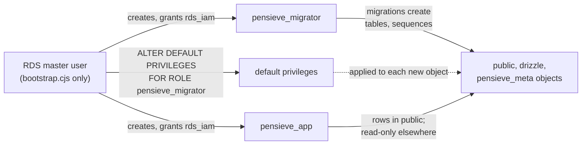

# Database schema

Everything in this page is drawn directly from `src/db/schema.ts` (233 lines, read in full — graphify's import/call-edge graph has no column-level data, so this page couldn't be produced from it alone). Nine tables, all in one file, no native Postgres enum types anywhere: role/kind columns are plain `text` with a TypeScript-level `{ enum: [...] }` constraint instead, because — per a comment at `src/db/schema.ts:24-27` — a native enum type is created in a fixed Postgres schema, which collides across the disposable per-test-run schemas the test harness creates for each Vitest run (`src/test/db.ts`).

## Entity-relationship diagram

```mermaid
erDiagram
    users ||--o{ webauthn_credentials : "owns"
    users ||--o{ sessions : "has"
    users ||--o{ recovery_codes : "has"
    users ||--o{ items : "created_by"
    users ||--o{ flashcards : "created_by"
    users ||--o{ invites : "created_by (as inviter)"
    users ||--o{ invites : "used_by (as invitee, nullable)"

    items ||--o{ items : "parent_id (self-ref: wiki tree)"
    items ||--o{ item_tags : "tagged via"
    tags ||--o{ item_tags : "applied via"

    flashcards ||--o{ flashcard_tags : "tagged via"
    tags ||--o{ flashcard_tags : "applied via"

    users {
        uuid id PK
        text display_name
        text role "admin | member (text+TS enum, not a PG enum)"
        timestamptz created_at
    }

    webauthn_credentials {
        uuid id PK
        uuid user_id FK "-> users.id, cascade delete"
        text credential_id UK "base64url WebAuthn credential ID"
        text public_key "base64url CBOR COSE key"
        integer counter "replay-detection counter"
        text_array transports
        timestamptz created_at
    }

    sessions {
        text id PK "SHA-256 hash of the session token"
        uuid user_id FK "-> users.id, cascade delete"
        timestamptz expires_at
        timestamptz created_at
    }

    recovery_codes {
        uuid id PK
        uuid user_id FK "-> users.id, cascade delete"
        text code_hash UK "SHA-256 hash of the code"
        timestamptz used_at "null until redeemed, once-only"
        timestamptz created_at
    }

    invites {
        uuid id PK
        text token_hash UK "SHA-256 hash of the invite token"
        uuid created_by FK "-> users.id, cascade delete"
        timestamptz expires_at
        timestamptz used_at "null until redeemed"
        uuid used_by FK "-> users.id, set null on delete"
        timestamptz created_at
    }

    items {
        uuid id PK
        text kind "link | tool | article | page"
        uuid parent_id FK "-> items.id, nullable, self-ref"
        text url "null for kind=page"
        text title "NOT NULL"
        text description
        text content "wiki markdown body, kind=page only"
        text notes "shared freeform note, every kind"
        uuid created_by FK "-> users.id, cascade delete"
        timestamptz created_at
        timestamptz updated_at
    }

    tags {
        uuid id PK
        text name UK "normalized: trimmed, collapsed, lowercased"
        timestamptz created_at
    }

    item_tags {
        uuid item_id PK, FK "-> items.id, cascade delete"
        uuid tag_id PK, FK "-> tags.id, cascade delete"
    }

    flashcards {
        uuid id PK
        text front
        text back
        text front_hash UK "SHA-256 of trimmed front"
        text source "citation, shown during study"
        uuid created_by FK "-> users.id, cascade delete"
        timestamptz created_at
        timestamptz updated_at
    }

    flashcard_tags {
        uuid flashcard_id PK, FK "-> flashcards.id, cascade delete"
        uuid tag_id PK, FK "-> tags.id, cascade delete"
    }
```

*(`pings` — a throwaway table that only exists to prove the test harness end-to-end, per a comment at `src/db/schema.ts:14-15` — is omitted; it has no relationships to the rest of the schema.)*

## Notable design decisions (all from comments in the schema file itself)

- **`items.parentId` is the entire wiki hierarchy.** There's no separate `pages` or `wiki_articles` table — a wiki page *is* a row in `items` with `kind: "page"`, and its position in the tree is just `items.parentId` pointing at another `items` row (`src/db/schema.ts:108-113`). The FK is typed `references((): AnyPgColumn => items.id)` — a thunk, because a table can't reference itself before its own `const` binding exists. Deliberately **no `onDelete` action** on that FK: re-parenting or cascading a delete through the tree is handled in application code (`src/services/items/wiki.ts`, specifically `deleteArticleWithChildren()` and `wouldCreateCycle()`), not by Postgres.
- **Nothing is stored as a live secret.** Session tokens, recovery codes, and invite tokens are all handed to the client raw but stored server-side only as a SHA-256 hash (`sessions.id`, `recovery_codes.code_hash`, `invites.token_hash`) — a stolen DB dump can't be replayed as a live session or a usable code/link.
- **`users` enforces "at most one admin" at the database level**, not just in application code: a partial unique index, `uniqueIndex("users_single_admin").on(sql\`(true)\`).where(sql\`role = 'admin'\`)` (`src/db/schema.ts:42-44`). This closes a race where two concurrent bootstrap-registration requests both see an empty `users` table and both try to insert the first admin.
- **`items` and `flashcards` are deliberately separate tables**, not one polymorphic table. A comment at `src/db/schema.ts:172-175` explains why: none of `items`' fields (`kind`, `parentId`, `url`, `description`, `notes`) apply to a flashcard, which is just a front/back recall pair. What they *do* share is the `tags` table — `item_tags` and `flashcard_tags` are structurally identical join tables against the same `tags` pool, so tag autocomplete and tag-pruning logic is shared across both features rather than duplicated (confirmed by `graphify explain "tags.ts"`, degree 43: both `src/services/items/items.ts` and `src/services/flashcards/flashcards.ts` import it directly, alongside `src/services/items/wiki.ts` and most item/flashcard pages).
- **`items.title` is `NOT NULL`**, but that wasn't always true — a comment (`src/db/schema.ts:119-123`) notes the constraint was added later (ticket "03: batch-import-export-and-article-item-type") once `createItem()` itself started rejecting a request that would otherwise resolve to an empty title; `scripts/backfill-item-titles.ts` exists specifically to backfill pre-existing rows before that constraint could be added.
- **`items.kind` grew a fourth value (`"article"`) after a rename**, not from scratch: the comment at `src/db/schema.ts:99-101` says `"page"` (the wiki kind) used to be stored as the literal string `"article"` before a migration renamed it, freeing up `"article"` for a new, link-shaped "saved to read" kind.

## Roles and grants

In AWS, nothing connects as the RDS master user except the one-off bootstrap. `db/bootstrap.sql` creates two least-privilege roles, and the DB image's `bootstrap.cjs` runs it as master (see [DB image](/architecture/deployable-image#db-image)). Both roles are granted `rds_iam`, so they log in only with short-lived IAM tokens, never a password.

| | `pensieve_migrator` | `pensieve_app` |
| --- | --- | --- |
| `public` (the tables above) | owns every table, sequence and type the migrations create | `SELECT`, `INSERT`, `UPDATE`, `DELETE` on tables, `USAGE` on sequences; no DDL |
| `drizzle` (migration bookkeeping) | owns it | `SELECT` only |
| `pensieve_meta` (`schema_compat`: the newest breaking migration applied) | owns it | `SELECT` only |
| Database | `CREATE` (the migrator issues `CREATE SCHEMA IF NOT EXISTS` for `drizzle` and `pensieve_meta`) | `CONNECT` only |

- **Default privileges, not per-table grants.** The app role's privileges come from `ALTER DEFAULT PRIVILEGES FOR ROLE pensieve_migrator`, set per schema. So every table a later migration creates is immediately readable and writable in `public`, and readable in `drizzle` and `pensieve_meta`, with no new grant.
- **The bootstrap pre-creates `drizzle` and `pensieve_meta`**, owned by the migrator, so the app role's `USAGE` and default privileges can be set before the migrator first runs.
- **Idempotent and additive.** Re-running the bootstrap is safe and changes nothing already in place, and it runs in one transaction, so a failure changes nothing either. It never removes a privilege: taking one away means adding an explicit `REVOKE` to the script and re-running it.
- **Run as master, but not as a superuser.** RDS's master user is a `CREATEROLE` user that owns the database, so the script first grants itself membership of `pensieve_migrator`, which acting for that role requires.

`db/bootstrap.test.ts` proves all of this against real Postgres. It runs the bootstrap as a non-superuser stand-in for the RDS master user, with a stub `rds_iam`, then applies the migrations as the migrator. Then, as the app role, it checks that the app role can read and write rows but is refused DDL, can write a table the migrator creates later, and can read but not write the bookkeeping table and `pensieve_meta`. A second bootstrap run must leave every role, membership, owner and privilege unchanged.
