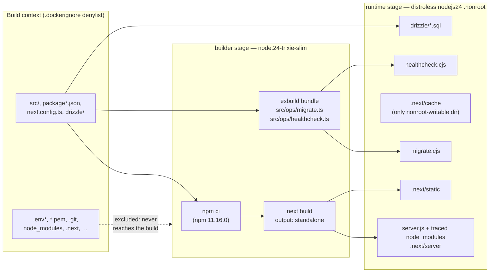
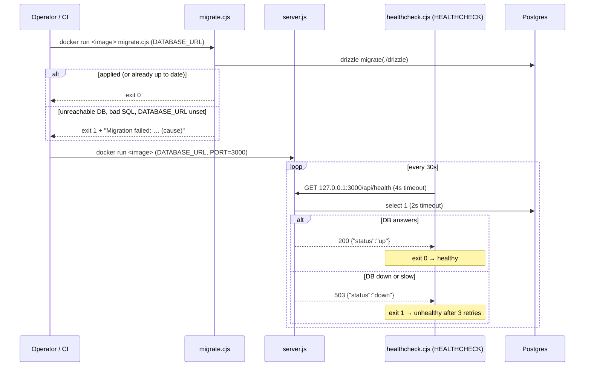

# Deployable image

The production artifact is a single container image, built by the root `Dockerfile` for `linux/arm64` only, to match the Graviton runtime it deploys to. The same image does two jobs. Its default command runs the Next.js server. A second entrypoint, `migrate.cjs`, applies database migrations, so the migration code always ships with the app code it belongs to.

## From source to image

Only the right-hand box ships. The builder stage holds the full toolchain and dev dependencies and is thrown away.

- **Standalone output** (`next.config.ts`). `next build` traces what `server.js` actually imports and copies only those files from `node_modules`. That trace is why the image needs no `npm install`, and it's also why a local `.env` is dangerous: Next copies `.env` and `.env.production` into `.next/standalone`. `.dockerignore` keeps every `.env*` out of the build context, so it never gets the chance.
- **No `sharp`.** `sharp` is an optional dependency of `next` that the server trace would otherwise pull in, along with its native libvips. Nothing uses `next/image`, so `images.unoptimized` turns off the optimizer and `outputFileTracingExcludes["next-server"]` drops `sharp`/`@img` from the trace.
- **Bundled ops entrypoints.** The standalone trace only follows what the server imports, so it leaves out drizzle-orm's migrator. esbuild bundles `src/ops/migrate.ts` (with drizzle-orm, postgres.js and `src/db/env.ts`'s `getDatabaseUrl`) and `src/ops/healthcheck.ts` into self-contained CommonJS files. That way the runtime needs neither drizzle-kit nor `tsx`.
- **Hardening.** The runtime base has no shell or package manager and runs as distroless's `nonroot` user, set by number (`65532`) so a runtime can verify it isn't root. Application files are root-owned, so the app user can only read them. The one writable path is `.next/cache`. Both base images are pinned by multi-arch index digest.

## Running the image

The health endpoint itself is described in [Health check](/flows/health-check). The `HEALTHCHECK` script exists because distroless has no `curl`: Node's built-in `fetch` makes the call. The migrator caps its connect timeout at 10s, so an unreachable database fails fast. It logs only error messages, never the driver's full error object, which can carry connection details.

## Testing the image

The Playwright suite in `e2e/` runs unchanged against a running container. Setting `PLAYWRIGHT_BASE_URL` turns off the config's `webServer` block (so no `next dev` starts), and the global setup derives its session cookie's domain from that URL. Global setup still seeds its user directly through `DATABASE_URL`, so the suite needs that variable to point at the same database the container uses. Run instructions are in the README.

## Building in CI

The CI `build` job builds the image natively on an arm64 runner, with Docker layers cached in the GitHub Actions cache. Before the image leaves the job, two tools scan it for embedded secrets:

- **Trivy** scans every layer's files and the image config (ENV, labels, build-arg history).
- **TruffleHog's `docker` source** scans the files with its own detectors. It fails on verified, unknown and unverified findings.

Any finding fails the job before the upload step, so a leaking image is never downloadable. Both tools' results go to GitHub Code Scanning even then. A clean image is uploaded as a `docker save` tarball artifact named `pensieve-image`. It's kept for 1 day as the hand-off to later jobs, or 14 days on a push to `develop`, where it's the deployable artifact.

Scanner false positives are recorded per tool, each with a reason and an expiry:

- Trivy in `trivy-secret.yaml`. Trivy has no expiry field, so the expiry goes in each rule's description and is reviewed by hand.
- TruffleHog in `.github/trufflehog-image-exclude.txt`. The job drops expired entries, so the finding blocks again. The file already excludes the distroless base's dpkg `*.md5sums` lists, which trip its Box detector.
