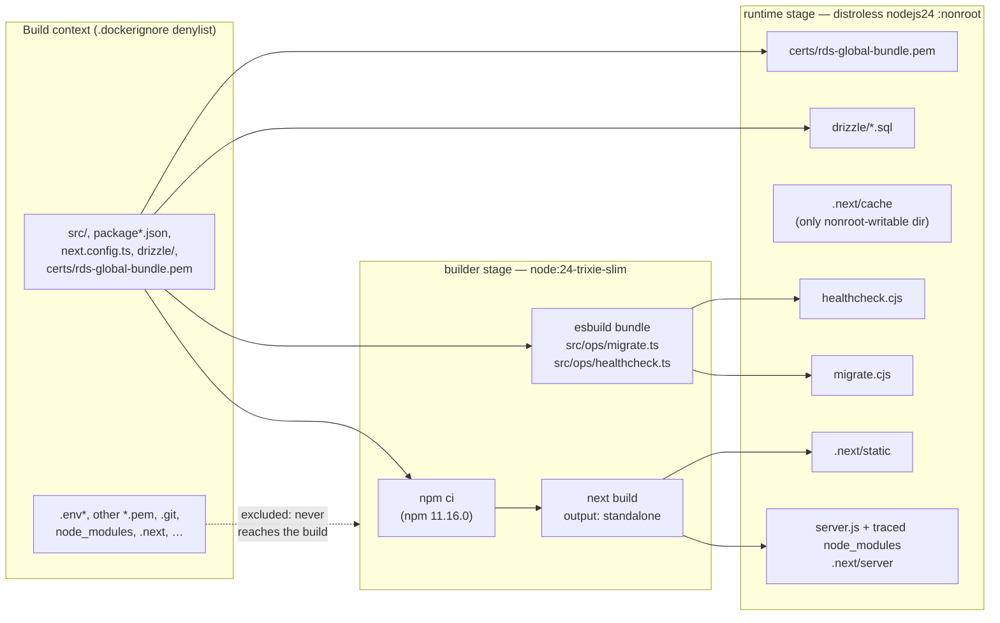
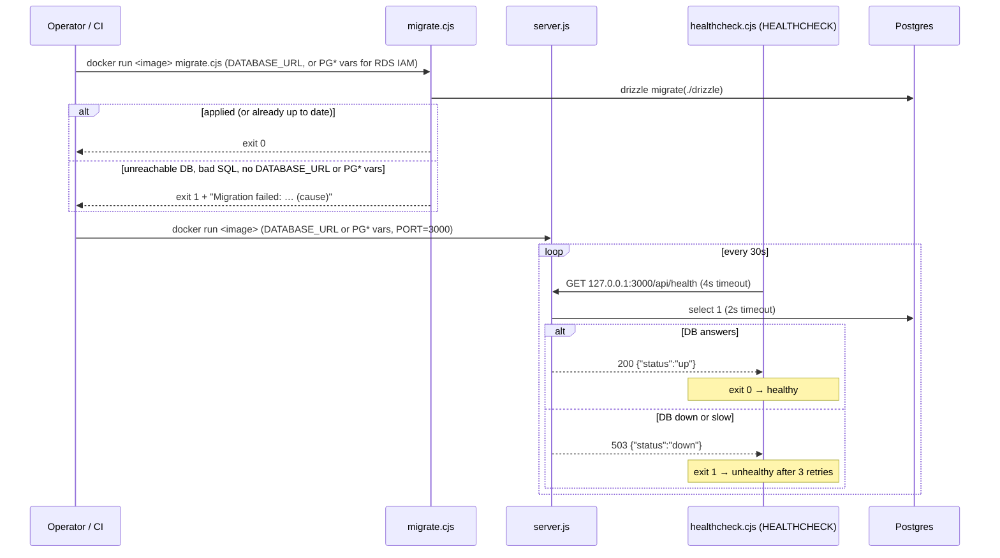

# Deployable image

The production artifact is a single container image, built by the root `Dockerfile` for `linux/arm64` only, to match the Graviton runtime it deploys to. The same image does two jobs. Its default command runs the Next.js server. A second entrypoint, `migrate.cjs`, applies database migrations, so the migration code always ships with the app code it belongs to.

## From source to image

Only the right-hand box ships. The builder stage holds the full toolchain and dev dependencies and is thrown away.

- **Standalone output** (`next.config.ts`). `next build` traces what `server.js` actually imports and copies only those files from `node_modules`. That trace is why the image needs no `npm install`, and it's also why a local `.env` is dangerous: Next copies `.env` and `.env.production` into `.next/standalone`. `.dockerignore` keeps every `.env*` out of the build context, so it never gets the chance.
- **No `sharp`.** `sharp` is an optional dependency of `next` that the server trace would otherwise pull in, along with its native libvips. Nothing uses `next/image`, so `images.unoptimized` turns off the optimizer and `outputFileTracingExcludes["next-server"]` drops `sharp`/`@img` from the trace.
- **Bundled ops entrypoints.** The standalone trace only follows what the server imports, so it leaves out drizzle-orm's migrator. esbuild bundles `src/ops/migrate.ts` (with drizzle-orm, postgres.js and the `src/db/connection.ts` connection helper, including the AWS RDS signer) and `src/ops/healthcheck.ts` into self-contained CommonJS files. That way the runtime needs neither drizzle-kit nor `tsx`.
- **RDS CA bundle.** In AWS the app and `migrate.cjs` connect with RDS IAM auth instead of a `DATABASE_URL`, which requires TLS. `certs/rds-global-bundle.pem` is AWS's public RDS CA bundle, committed to the repo and copied into the image, and the connection helper verifies the database's certificate against it. It's the one `*.pem` the `.gitignore` and `.dockerignore` let through.
- **Hardening.** The runtime base has no shell or package manager and runs as distroless's `nonroot` user, set by number (`65532`) so a runtime can verify it isn't root. Application files are root-owned, so the app user can only read them. The one writable path is `.next/cache`. Both base images are pinned by multi-arch index digest.

## Running the image

The health endpoint itself is described in [Health check](/flows/health-check). The `HEALTHCHECK` script exists because distroless has no `curl`: Node's built-in `fetch` makes the call. The migrator caps its connect timeout at 10s, so an unreachable database fails fast. It logs only error messages, never the driver's full error object, which can carry connection details.

## Testing the image

The Playwright suite in `e2e/` runs unchanged against a running container. Setting `PLAYWRIGHT_BASE_URL` turns off the config's `webServer` block (so no `next dev` starts), and the global setup derives its session cookie's domain from that URL. Global setup still seeds its user directly through `DATABASE_URL`, so the suite needs that variable to point at the same database the container uses. Run instructions are in the README.

In CI, the `e2e` job does exactly this against the image the `build` job produced, so the suite exercises the standalone server, the Dockerfile and the migration entrypoint, not `next dev`. On an arm64 runner it starts a fresh Postgres service container, runs `migrate.cjs` from the image as the Postgres superuser, starts the app, and waits for `/api/health` to return 200. It then runs Playwright from the official `mcr.microsoft.com/playwright` image, at the same version as `@playwright/test`. Every container shares the host network, so the browser reaches the app at `http://localhost:3000`. That matters because the production session cookie is `Secure`, and Chrome accepts a `Secure` cookie over plain HTTP only on `localhost`. On failure, the job prints the app container's logs and keeps the Playwright HTML report as an artifact for 3 days.

## Building in CI

The CI `build` job builds the image natively on an arm64 runner, with Docker layers cached in the GitHub Actions cache. Before the image leaves the job, Trivy scans it for embedded secrets: every layer's files and the image config (ENV, labels, build-arg history). Its built-in rules don't cover connection strings, so `trivy-secret.yaml` adds a custom rule for any URL with an embedded password, such as a `DATABASE_URL`.

Any finding fails the job before the upload step, so a leaking image is never downloadable. The results go to GitHub Code Scanning even then. A clean image is uploaded as a `docker save` tarball artifact named `pensieve-image`. It's kept for 1 day as the hand-off to later jobs, or 14 days on a push to `develop`, where it's the deployable artifact.

Scanner false positives go in `trivy-secret.yaml` as allow rules, each with a reason and an expiry in its description. Trivy has no expiry field, so expired rules are reviewed by hand.

A `trivy` job then downloads that artifact and scans it for known vulnerabilities: the Debian packages from the distroless base and the npm packages in the standalone bundle. It fails on any severity, but only when a fixed version exists, so nobody is blocked on an upstream CVE they can't act on. A deliberate exception goes in `.trivyignore` with its reason and an `exp:` date, which Trivy enforces. The vulnerability database comes from the `public.ecr.aws` mirror and is cached for a day. Results go to Code Scanning under their own category, separate from the secret scan. One gap: the distroless base installs Node from a tarball, not as a Debian package, so Trivy can't see the Node runtime's own version. Node stays patched through Dependabot's base-image digest updates.
