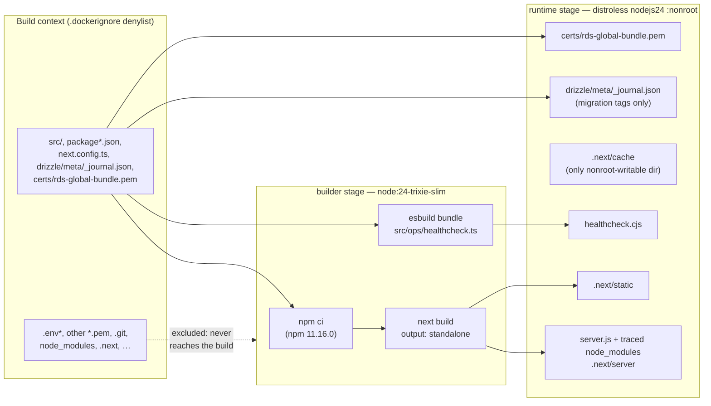
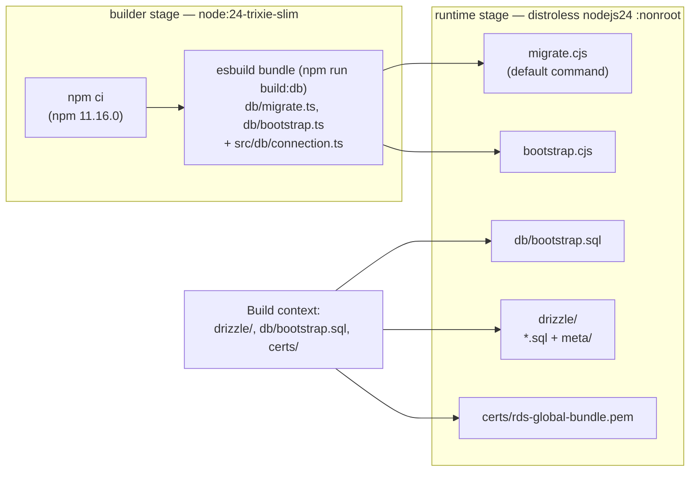

# Deployable image

Pensieve ships as two container images, both built for `linux/arm64` only, to match the Graviton runtime they deploy to:

- **The app image**, built by the root `Dockerfile`, runs the Next.js server. It contains no migration SQL and no migrator, so it can't change the schema.
- **The DB image**, built by `db/Dockerfile`, holds the Drizzle migrations and the migrator that applies them, and no Next.js or app code. It's the database's own artifact, so a schema change and an app release can ship independently (see [DB image](#db-image)).

## From source to image (app)



Only the right-hand box ships. The builder stage holds the full toolchain and dev dependencies and is thrown away.

- **Standalone output** (`next.config.ts`). `next build` traces what `server.js` actually imports and copies only those files from `node_modules`. That trace is why the image needs no `npm install`, and it's also why a local `.env` is dangerous: Next copies `.env` and `.env.production` into `.next/standalone`. `.dockerignore` keeps every `.env*` out of the build context, so it never gets the chance.
- **No `sharp`.** `sharp` is an optional dependency of `next` that the server trace would otherwise pull in, along with its native libvips. Nothing uses `next/image`, so `images.unoptimized` turns off the optimizer and `outputFileTracingExcludes["next-server"]` drops `sharp`/`@img` from the trace.
- **Bundled healthcheck.** The standalone trace only follows what the server imports, so esbuild bundles `src/ops/healthcheck.ts` into a self-contained CommonJS file. The runtime needs no `tsx`.
- **Migration journal, not migrations.** The image carries `drizzle/meta/_journal.json`, the list of migration tags this build was made against, and none of the SQL. It's there for the app's startup schema check (spec 13).
- **RDS CA bundle.** In AWS the app and the DB image's migrator connect with RDS IAM auth instead of a `DATABASE_URL`, which requires TLS. `certs/rds-global-bundle.pem` is AWS's public RDS CA bundle, committed to the repo and copied into both images, and the connection helper verifies the database's certificate against it. It's the one `*.pem` the `.gitignore` and `.dockerignore` let through.
- **Hardening.** The runtime base has no shell or package manager and runs as distroless's `nonroot` user, set by number (`65532`) so a runtime can verify it isn't root. Application files are root-owned, so the app user can only read them. The one writable path is `.next/cache`. Both base images are pinned by multi-arch index digest.

## DB image

`db/Dockerfile` is built from the repository root (`docker build -f db/Dockerfile .`) with the same bases and hardening as the app image: a `node:24-trixie-slim` builder stage runs `npm ci`, and the runtime stage is distroless Node `nonroot`, both pinned by multi-arch index digest and kept current by Dependabot.



- **Only the database's entrypoints.** The builder copies in just what the bundles import (`db/`, `src/db/` and `tsconfig.json` for the `@/` alias), and esbuild bundles `db/migrate.ts` and `db/bootstrap.ts`, each with postgres.js and the `src/db/connection.ts` helper (including the AWS RDS signer), into self-contained CommonJS files. The runtime needs neither drizzle-kit nor `node_modules`.
- **Its default command migrates.** `docker run <db-image>` runs `migrate.cjs`, which applies the pending migrations under `drizzle/` and exits 0, or 1 on any failure. It works out what's pending exactly as drizzle-orm's migrator does: journal entries newer than the newest one recorded in Drizzle's bookkeeping table. It then applies them in one transaction, with the same bookkeeping rows, so it and drizzle-kit always agree on what's applied.
  - **Breaking migrations are refused by default.** If any pending migration's SQL file starts with `-- pensieve:breaking`, it exits 1 naming them and applies nothing, unless `ALLOW_BREAKING=true` (see the README's "Additive or breaking?").
  - **`pensieve_meta.schema_compat`.** In the same transaction it upserts this single-row table with the tag of the newest breaking migration ever applied (null if none). The app's startup check (ticket 44) will read it.
  - A failure anywhere rolls the whole batch back. It connects through the same helper as the app: `DATABASE_URL` when it's set, RDS IAM auth from the `PG*` variables otherwise.
- **`bootstrap.cjs` creates the roles and grants.** `docker run <db-image> bootstrap.cjs` runs `db/bootstrap.sql` in one transaction, so a failure changes nothing (see [Roles and grants](/architecture/database-schema#roles-and-grants)). In AWS it logs in as the RDS master user, with the user and password ECS injects from the RDS-managed master secret (the helper's password mode, still over verified TLS). It runs only as a one-off task the maintainer launches, never from CI.
- **Everything is read-only.** No path in the image is writable by the `nonroot` user, and nothing needs to be.

Local development and the app's CI don't use the DB image. They migrate with drizzle-kit (`npm run db:migrate`).

## Running the images

```mermaid
sequenceDiagram
    participant Op as Operator / CI
    participant Mig as DB image (migrate.cjs)
    participant App as app image (server.js)
    participant HC as healthcheck.cjs (HEALTHCHECK)
    participant DB as Postgres

    Op->>Mig: docker run <db-image> (DATABASE_URL, or PG* vars for RDS IAM)
    Mig->>DB: BEGIN; read Drizzle's bookkeeping table
    alt a pending migration is breaking and ALLOW_BREAKING isn't "true"
        Mig->>DB: ROLLBACK
        Mig-->>Op: exit 1 + "breaking migration(s) pending: <tags>"
    else pending migrations apply
        Mig->>DB: pending SQL, bookkeeping rows, upsert pensieve_meta.schema_compat; COMMIT
        Mig-->>Op: exit 0 (also when nothing was pending)
    else unreachable DB, bad SQL, no DATABASE_URL or PG* vars
        Mig-->>Op: exit 1 + "Migration failed: … (cause)", nothing applied
    end

    Op->>App: docker run <app-image> (DATABASE_URL or PG* vars, PORT=3000)
    loop every 30s
        HC->>App: GET 127.0.0.1:3000/api/health (4s timeout)
        App->>DB: select 1 (2s timeout)
        alt DB answers
            App-->>HC: 200 {"status":"up"}
            Note over HC: exit 0 → healthy
        else DB down or slow
            App-->>HC: 503 {"status":"down"}
            Note over HC: exit 1 → unhealthy after 3 retries
        end
    end
```

The health endpoint itself is described in [Health check](/flows/health-check). The `HEALTHCHECK` script exists because distroless has no `curl`: Node's built-in `fetch` makes the call. The migrator caps its connect timeout at 10s, so an unreachable database fails fast. It logs only error messages, never the driver's full error object, which can carry connection details.

## Testing the app image

The Playwright suite in `e2e/` runs unchanged against a running container. Setting `PLAYWRIGHT_BASE_URL` turns off the config's `webServer` block (so no `next dev` starts), and the global setup derives its session cookie's domain from that URL. Global setup still seeds its user directly through `DATABASE_URL`, so the suite needs that variable to point at the same database the container uses. Run instructions are in the README.

In CI, the `e2e` job does exactly this against the image the `build` job produced, so the suite exercises the standalone server and the Dockerfile, not `next dev`. On an arm64 runner it starts a fresh Postgres service container, migrates it with `npm run db:migrate` (drizzle-kit, as in local development) as the Postgres superuser, starts the app, and waits for `/api/health` to return 200. It then runs Playwright from the official `mcr.microsoft.com/playwright` image, at the same version as `@playwright/test`. Every container shares the host network, so the browser reaches the app at `http://localhost:3000`. That matters because the production session cookie is `Secure`, and Chrome accepts a `Secure` cookie over plain HTTP only on `localhost`. On failure, the job prints the app container's logs and keeps the Playwright HTML report as an artifact for 3 days.

## Building in CI

The CI `build` job builds the app image natively on an arm64 runner, with Docker layers cached in the GitHub Actions cache. Before the image leaves the job, Trivy scans it for embedded secrets: every layer's files and the image config (ENV, labels, build-arg history). Its built-in rules don't cover connection strings, so `trivy-secret.yaml` adds a custom rule for any URL with an embedded password, such as a `DATABASE_URL`.

Any finding fails the job before the upload step, so a leaking image is never downloadable. The results go to GitHub Code Scanning even then. A clean image is uploaded as a `docker save` tarball artifact named `pensieve-image`. It's kept for 1 day as the hand-off to later jobs, or 14 days on a push to `develop`, where it's the deployable artifact.

Scanner false positives go in `trivy-secret.yaml` as allow rules, each with a reason and an expiry in its description. Trivy has no expiry field, so expired rules are reviewed by hand.

A `trivy` job then downloads that artifact and scans it for known vulnerabilities: the Debian packages from the distroless base and the npm packages in the standalone bundle. It fails on any severity, but only when a fixed version exists, so nobody is blocked on an upstream CVE they can't act on. A deliberate exception goes in `.trivyignore` with its reason and an `exp:` date, which Trivy enforces. The vulnerability database comes from the `public.ecr.aws` mirror and is cached for a day. Results go to Code Scanning under their own category, separate from the secret scan. One gap: the distroless base installs Node from a tarball, not as a Debian package, so Trivy can't see the Node runtime's own version. Node stays patched through Dependabot's base-image digest updates.

### DB image (`db.yml`)

The DB image has its own workflow, `.github/workflows/db.yml`. It runs on pull requests into `develop`/`main` and pushes to them, but only when a database source changes: `drizzle/`, `db/`, `src/db/`, `certs/`, `drizzle.config.ts`, `.dockerignore` or the workflow itself. App-only changes and dependency bumps skip it. For the same reason its jobs aren't required checks in the rulesets, since a required check whose workflow never ran would block the PR. A failing run still shows on the PR. Dependency bumps are still covered by `ci.yml`'s `unit` job, which runs drizzle-orm's migrator on every change.

- **`db-image`** builds the DB image natively on an arm64 runner and scans it as the app image is scanned: Trivy's secret scan with `trivy-secret.yaml`, then its vulnerability scan with `.trivyignore`. Either finding fails the job, and both go to Code Scanning (`Secrets`, `Container SCA`). The migrator is a single esbuild bundle that Trivy can't see into, so this scan covers the distroless base. The npm packages bundled into it also ship in the app image, where the `trivy` job sees them. A clean image is uploaded as the `pensieve-db-image` artifact for 1 day.
- **`db-grants`** runs the grants test (`db/bootstrap.test.ts`, see [Roles and grants](/architecture/database-schema#roles-and-grants)) against a `postgres:17-alpine` service container. `ci.yml`'s `unit` job also runs it, with the rest of the suite.
- **`db-apply`** runs that image's migrator against a fresh `postgres:17-alpine` service container, applying every migration to an empty database. It then checks that Drizzle's bookkeeping table records as many migrations as the journal lists.
