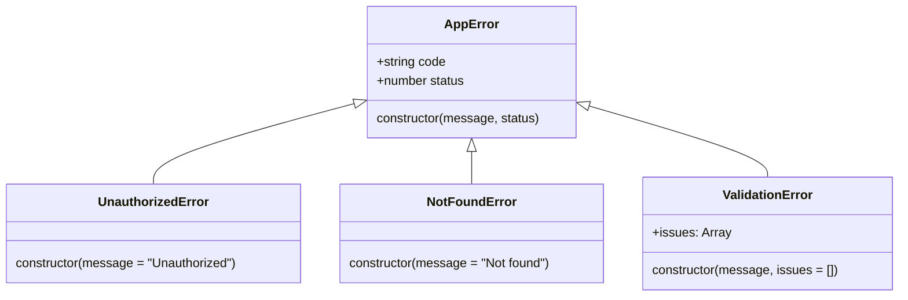
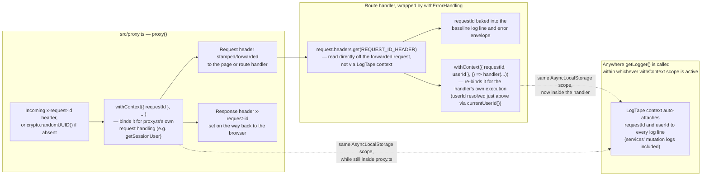
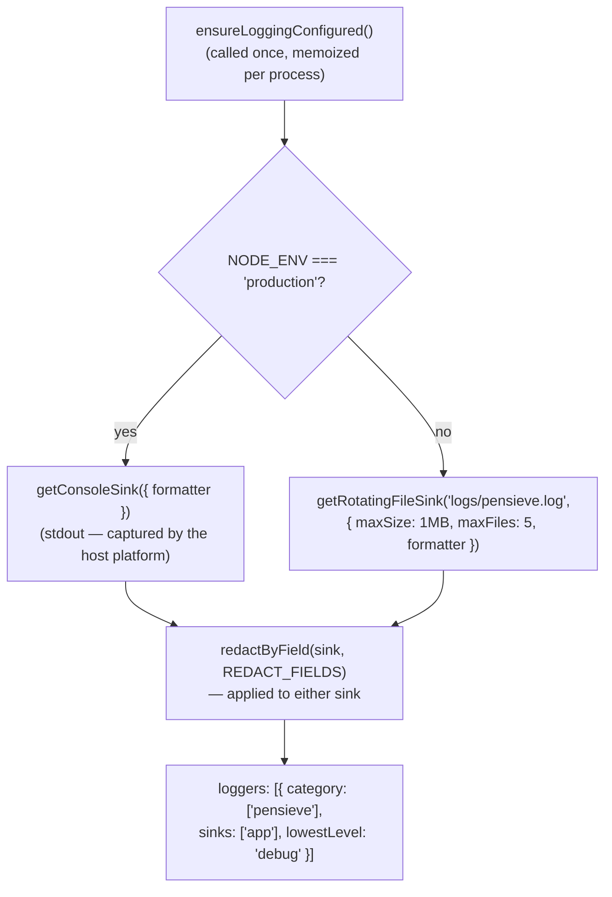
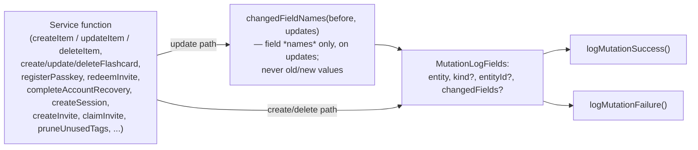

# Error handling & logging

This page documents the design that tickets 01–10 introduced: a typed
`AppError` taxonomy, a single response-envelope wrapper (`withErrorHandling`)
that every route now uses instead of hand-rolled `try`/`catch`, end-to-end
request correlation via an `x-request-id` header and LogTape's
`AsyncLocalStorage`-backed context, a structured log pipeline with field
redaction, and a mutation-logging layer on top of it. See
**[System overview](/architecture/system-overview)** for where this sits in
the request lifecycle as a whole (that page still shows the older
`toErrorResponse` path for routes tickets 05–07 already migrated off of —
this page is the up-to-date, dedicated look at the error/logging design
itself).

## The `AppError` taxonomy

Every service-layer error is a subclass of `AppError` (`src/services/errors.ts`).
The base class derives a machine-readable `code` from the subclass's own
constructor name (`new.target.name`) rather than each subclass hardcoding
one — `"NotFoundError"` becomes `"NOT_FOUND"`, `"ValidationError"` becomes
`"VALIDATION"` — so a status/code pair can never drift out of sync with the
class name:



| Class | Status | `code` | Notes |
|---|---|---|---|
| `UnauthorizedError` | 401 | `UNAUTHORIZED` | Thrown by `getCurrentUser()` (no/invalid session header) and `getSessionUser()` (bad/expired session token) |
| `NotFoundError` | 404 | `NOT_FOUND` | Thrown by service functions when a lookup by ID misses |
| `ValidationError` | 400 | `VALIDATION` | Carries a typed `issues: { field: string; message: string }[]` array — how `parseOrThrow()` (`src/lib/validation.ts`) surfaces per-field Zod failures (tickets 13/15–18) |

Any other thrown value (a bug, a Postgres error, anything not deliberately
raised as one of the three classes above) is treated as *unexpected* and
never reaches the client as anything more specific than a generic 500 — see
below.

## `withErrorHandling` and the response envelope

`withErrorHandling()` (`src/lib/api-errors.ts:51-103`) wraps a route handler
and is what every migrated route (`src/app/api/**/route.ts`, tickets 05–07)
exports its `GET`/`POST`/`PATCH`/`DELETE` as, e.g.
`export const POST = withErrorHandling(async (request) => { ... })`. It
replaces the older per-route `toErrorResponse()` helper, which is still
present but `@deprecated` (`src/lib/api-errors.ts:7-17`) — kept only because
`toErrorResponse` doesn't wrap the whole handler, so it can't add the
baseline logging or requestId propagation below.

```mermaid
flowchart TD
    Handler["Route handler body<br/>(the function withErrorHandling wraps)"]
    Success["Response returned normally"]
    Thrown{"Threw?"}
    IsAppError{"instanceof AppError?"}
    AppErrResp["{ error: { code, message, requestId,\n  ...(issues?.length ? { issues } : {}) } }\nstatus = err.status\nlogged at warning"]
    UnknownResp["{ error: { code: \"INTERNAL\",\n  message: \"Something went wrong. Please try again.\",\n  requestId } }\nstatus = 500\nlogged at error (with real message)"]
    BaselineLog["One baseline log line either way:\nroute, method, durationMs, userId, requestId, status"]

    Handler --> Thrown
    Thrown -->|no| Success --> BaselineLog
    Thrown -->|yes| IsAppError
    IsAppError -->|yes| AppErrResp --> BaselineLog
    IsAppError -->|no| UnknownResp --> BaselineLog
```

The exact envelope shape returned to the client, as implemented today
(`src/lib/api-errors.ts:87-90`):

```jsonc
// Any thrown AppError
{
  "error": {
    "code": "NOT_FOUND",       // derived from the class name
    "message": "Item not found",
    "requestId": "3fa1...",    // omitted (undefined) only if no x-request-id header was present
    "issues": [                // present only for ValidationError with a non-empty issues array —
      { "field": "title", "message": "Required" }  // otherwise the key is omitted entirely, never `issues: []`
    ]
  }
}

// Anything else thrown (a bug, unhandled exception, etc.) — status 500
{
  "error": {
    "code": "INTERNAL",
    "message": "Something went wrong. Please try again.",
    "requestId": "3fa1..."
  }
}
```

Two details worth calling out because they're easy to get wrong reading the
code quickly:

- The real exception (stack trace, message) behind an `INTERNAL` 500 is
  **only ever logged**, never put in the response body — the code comment
  at `api-errors.ts:93-95` is explicit that this is deliberate (no leaking
  DB connection strings, stack frames, etc., to a client).
- `issues` is a *passthrough*, not a rename — it's the same array
  `ValidationError.issues` already carries (set by `parseOrThrow()` when a
  Zod schema fails), added to the envelope by ticket 15. It's conditionally
  spread (`...(issues ? { issues } : {})`) so a `ValidationError` thrown
  with an empty/no `issues` array (e.g. from `parseOrThrow`'s own internal
  invariant checks that don't map to a single field) omits the key
  entirely rather than sending an empty array.

## Correlation-ID propagation

Every request gets an `x-request-id` — preserved from an upstream caller if
already present, minted fresh (`crypto.randomUUID()`) otherwise — that flows
through several independent mechanisms rather than one, because `proxy.ts`
and route-handler code don't share module state (Next's own docs warn
against relying on that — see the comment at `src/lib/request-id.ts:6-12`),
so `proxy.ts`'s own `AsyncLocalStorage` binding doesn't reach a route
handler on its own:



Concretely:

1. **`src/lib/request-id.ts`** owns the single shared constant,
   `REQUEST_ID_HEADER = "x-request-id"` — deliberately its own tiny
   side-effect-free module (not exported from `proxy.ts` directly) so
   `api-errors.ts` can import just the constant without pulling in
   `proxy.ts`'s side-effecting `ensureLoggingConfigured()` call or its
   `config`/matcher export.
2. **`proxy.ts` (`:57-82`)** resolves `requestId` (incoming header, or a
   fresh UUID — an empty header is treated as absent, so a misbehaving
   upstream can't blank out correlation), then runs the rest of *its own*
   request handling inside `withContext({ requestId }, ...)`. Because
   LogTape's `contextLocalStorage` is an `AsyncLocalStorage` (wired up in
   `ensureLoggingConfigured()`, `src/lib/logging.ts:52`), any
   `getLogger(...).info/warn/error(...)` call made while still inside that
   callback (e.g. `getSessionUser`) automatically has `requestId` attached.
   This binding does **not** carry over once Proxy hands off to a route
   handler — Next's own docs warn `AsyncLocalStorage` context isn't
   preserved across that boundary — which is why point 5 below exists.
3. Separately (and redundantly, on purpose — see point 1), `proxy.ts` also
   stamps `x-request-id` onto the **request** headers it forwards
   (`withRequestId()`, `:118-122`) and onto the **response** headers on the
   way back to the browser (`:80`), so the ID survives the Proxy → route
   handler boundary even though that boundary doesn't preserve
   `AsyncLocalStorage` context, and the browser/upstream caller can
   correlate its own logs against the server's.
4. **`withErrorHandling` (`api-errors.ts:58`)** reads `x-request-id` back
   off the incoming `Request` directly (not via LogTape context) to bake
   it into both the baseline log line and the error envelope shown above.
5. **`withErrorHandling` also re-binds it** (`api-errors.ts`): it runs the
   wrapped handler inside its own `withContext({ requestId, userId }, () =>
   handler(...))`, rather than relying on Proxy's binding from point 2 (which
   can't reach this far, per point 2's caveat). `userId` (ticket 24) is
   resolved right above via `currentUserId()` — the same best-effort lookup
   the baseline log line already used, now also bound into context alongside
   `requestId`. This is what makes both automatically show up on *every* log
   line the handler's execution produces — including service-layer mutation
   logs (`logMutationSuccess`/`logMutationFailure`, see [Mutation
   logging](#mutation-logging) below) — with no field added to
   `MutationLogFields` and no change to any individual service call site.
   `userId` is `undefined` when the request is unauthenticated (e.g.
   login/recovery routes), same as the baseline log line's existing
   behavior.

`ensureLoggingConfigured()` itself must be awaited before `withContext()` is
relied on: `configure()` is async, and an unawaited race on a cold start
would leave `contextLocalStorage` unset, making `withContext()` silently
no-op rather than bind the context (`src/lib/logging.ts:41-48`,
`src/proxy.ts:58-63`).

## Log pipeline

`ensureLoggingConfigured()` (`src/lib/logging.ts:49-62`) configures LogTape
exactly once per process (subsequent calls reuse the same settled promise)
and picks a sink based on environment:



- **Format**: both sinks are configured with `formatter:
  getJsonLinesFormatter()` (`logging.ts`) — one JSON object per line, e.g.
  `{"@timestamp":"...","level":"INFO","message":"Item created","logger":"pensieve.items","properties":{"entity":"items","kind":"link","entityId":"...","requestId":"..."}}`.
  Without an explicit `formatter`, both `getConsoleSink()` and
  `getRotatingFileSink()` fall back to LogTape's default text formatter
  (`timestamp [LEVEL] category: message`), which never serializes
  `record.properties` — every structured field a call site passes
  (`entityId`, `requestId`, `route`, `status`, etc.) would otherwise be
  silently dropped at the sink regardless of what the call site does right.
- **Dev**: a rotating file sink at `logs/pensieve.log` (1&nbsp;MB per file,
  5 files kept) via `@logtape/file`'s `getRotatingFileSink`. Its parent
  directory is created explicitly (`mkdirSync(..., { recursive: true })`,
  `logging.ts:27`) since the sink doesn't do that itself.
- **Prod**: `@logtape/logtape`'s `getConsoleSink()` — plain stdout, on the
  assumption the host platform captures and aggregates it (no rotation
  logic needed there).
- **Redaction**: both sinks are wrapped in `@logtape/redaction`'s
  `redactByField()`, using an app-specific `REDACT_FIELDS` list
  (`logging.ts:12-19`) that **replaces**, not merges with, the library's
  own `DEFAULT_REDACT_FIELDS` — meaning every sensitive field this app
  cares about must be listed explicitly:

  ```
  /session.*token/i
  /auth.*token/i
  "token"
  /credential/i
  /email/i
  /recovery.*code/i
  ```

  This is a field-*name* match (regex or exact string), not a value
  pattern — any log field whose key matches one of these has its value
  redacted regardless of what the value looks like.
- All app logging sits under the `["pensieve"]` category
  (`lowestLevel: "debug"`); route-level logs use `getLogger(["pensieve",
  "api"])` (`api-errors.ts:59`), service-level logs use their own
  sub-category (e.g. `getLogger(["pensieve", "items"])` in
  `src/services/items/items.ts:13`).

## Mutation logging

On top of the baseline per-request log line, `src/services/mutation-log.ts`
adds a second, narrower layer: one log line per create/update/delete of a
user-owned entity, independent of whether the request as a whole succeeded.
Two helpers, both taking a caller-supplied `Logger` (so each service keeps
its own category) and a shared `MutationLogFields` shape:

- **`logMutationSuccess(logger, message, fields)`** — `info` level.
- **`logMutationFailure(logger, message, fields, error)`** — `error` level,
  adds `error: error.message` (never the raw error object or the mutation
  payload — `mutation-log.ts:48-53`).

Neither helper takes a `requestId` or a `userId` — `MutationLogFields`
doesn't carry either, and no individual service call site passes one. They
don't need to: `withErrorHandling`'s own `withContext({ requestId, userId },
...)` binding (point 5 of [Correlation-ID
propagation](#correlation-id-propagation) above) covers the handler's entire
execution, so LogTape's `AsyncLocalStorage` context auto-attaches both
`requestId` and `userId` to every `logMutationSuccess`/`logMutationFailure`
call made anywhere downstream — with no threading required. This relies on
every current mutation-log call being `await`ed synchronously within the
request's call stack (true today for all of them); a fire-and-forget
mutation call would need an explicit field instead, since it could
outlive the bound context.



`MutationLogFields.entity` is a closed union —
`"items" | "flashcards" | "tags" | "invites" | "sessions" |
"recoveryCodes" | "webauthnCredentials" | "webauthnUsers"` — matching the
entities mutated across tickets 09 (items/flashcards) and 10 (the
remaining auth/tags entities: sessions, invites, recovery codes, WebAuthn
credentials/users, tags). `kind` is the item's own `kind` column
(`link`/`tool`/`article`/`page`), set only for `entity: "items"` and only
when known — it's absent from an update/delete failure whose item lookup
itself failed (e.g. not found). `entityId` is omitted only when a *create* fails
before its row exists (nothing to log yet); `changedFields` only appears on
updates, computed by `changedFieldNames()` — a diff over the *keys* the
update payload touched, comparing only those keys against the pre-update
row, so a field the payload never mentions can't spuriously show up as
"changed."

A representative call site (`src/services/items/items.ts:178-183,
493-496`):

```ts
const logger = getLogger(["pensieve", "items"]);
// ...
logMutationSuccess(logger, "Item created", { entity: "items", kind: input.kind, entityId: row.id });
// ...
logMutationFailure(logger, "Item creation failed", { entity: "items", kind: input.kind, entityId: insertedId }, error);
// ...
const changedFields = changedFieldNames(before, updates);
logMutationSuccess(logger, "Item updated", { entity: "items", kind, entityId: id, changedFields });
```

The same pattern is repeated in `src/services/flashcards/flashcards.ts`
(create/update/delete), `src/services/auth/webauthn.ts` (`registerPasskey`,
`redeemInvite`, `completeAccountRecovery`), `src/services/auth/session.ts`
(`createSession`), `src/services/auth/invites.ts` (`createInvite`,
`claimInvite`), and `src/services/tags/tags.ts` (`pruneUnusedTags`) —
confirmed via `graphify query "logMutationSuccess call sites items
flashcards"`, which returned all call sites across every entity kind in one
scoped subgraph.
