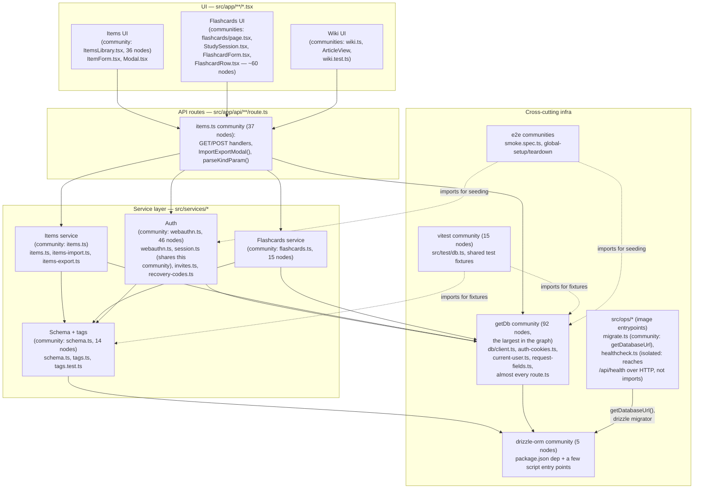

# Module structure

This page is built directly from graphify's community-detection output (`graphify-out/GRAPH_REPORT.md`, "Communities" and "God Nodes" sections, and `graphify-out/graph.json`) rather than from a fresh read of the source tree. Louvain-style clustering on the 1,436-node/2,415-edge import-and-call graph found **613 communities**; most are tiny (a component and its two or three direct helpers). The diagram below keeps only the communities large enough to represent a real subsystem, and groups them by what they actually do — graphify's own community *labels* (it names a community after one representative node, e.g. "webauthn.ts" or "getDb") are a starting point but needed my own read of "what's actually in this cluster" to turn into an architecture picture.

## Filtering out non-code communities

Worth flagging up front: graphify indexed the **entire repository**, not just `src/`. A meaningful slice of the 41 communities the report surfaces are markdown documentation, not code — e.g. "Test-Driven Development" (a TDD guide), "Ponytail" and "to-spec/SKILL.md" (Claude Code skill docs), "Process" (a ticket-writing process doc), and "CLAUDE.md" itself. These are legitimate clusters in the corpus but noise for an *application* architecture diagram, so they're excluded below.

## Module dependency diagram

`src/ops/*` is never imported by the app. Its two files are bundled into the container image as the migration and `HEALTHCHECK` entrypoints (see [Deployable image](/architecture/deployable-image)).

## What the community structure actually tells you

- **`getDb` is its own 92-node community — the largest in the graph — and it's mostly *not* about the database.** Reading its member list (`graphify-out/GRAPH_REPORT.md`, "Community 614"), it's dominated by route handlers (`POST()`/`GET()` functions from a dozen+ different `route.ts` files) plus `src/lib/auth-cookies.ts`, `src/lib/current-user.ts`, and `src/lib/request-fields.ts`. Community detection grouped them together because they all share one thing: they all import `getDb()` directly. This is the graph's way of confirming what the [system overview](/architecture/system-overview) page describes narratively — `getDb()` (71 edges, the single highest-degree node in the whole graph per the God Nodes list) and `toErrorResponse()` (47 edges, #2) are the two cross-cutting seams nearly every route passes through.
- **`webauthn.ts` (community 3, 46 nodes) is the single largest *feature* community**, bigger than either items or flashcards individually. It includes `session.ts`, `invites.ts`, `recovery-codes.ts`, and their tests — i.e. graphify's clustering independently rediscovered that auth is one tightly-coupled subsystem, which matches reading the source: `webauthn.ts` imports from all three of those files (see [system overview](/architecture/system-overview)).
- **Items and flashcards are structurally parallel but only loosely coupled**, confirmed two ways:
  - `graphify path "items.ts" "flashcards.ts"` returns **no directed path found** (the graph was built directed; the tool suggests re-running with `--undirected`, which wasn't necessary here since the BFS query below already shows how they meet — transitively, through shared infra, not directly).
  - `graphify query "how do items and flashcards share tags"` (BFS, depth 2) surfaces both `items.ts` and `flashcards.ts` as importers of `tags.ts`, and `tags.ts` sits in the `schema.ts` community rather than either feature's own community — i.e. the graph itself places the shared `tags` table's service in a neutral, infra-adjacent cluster rather than "belonging" to either feature. This matches the schema-level finding in [database schema](/architecture/database-schema): `item_tags` and `flashcard_tags` are separate join tables against one shared `tags` table.
- **The UI communities split by feature, not by component type.** There's no single "components" community — `ItemsLibrary.tsx` (36 nodes: list view, tag filtering, `ImportExportModal()`), `FlashcardForm.tsx`/`FlashcardRow.tsx`/`StudySession.tsx` (flashcards' own three separate UI communities), and `ArticleView`/`Modal.tsx` (wiki + shared modal) each cluster around the feature they render, which tracks with `src/app/` being organized by route/feature rather than by a shared `components/` directory.
- **Import cycles: none.** `GRAPH_REPORT.md`'s "Import Cycles" section reports `None detected` — worth calling out since a 613-community, 1,436-node graph is exactly the size where an accidental cycle would be easy to miss by eye.
