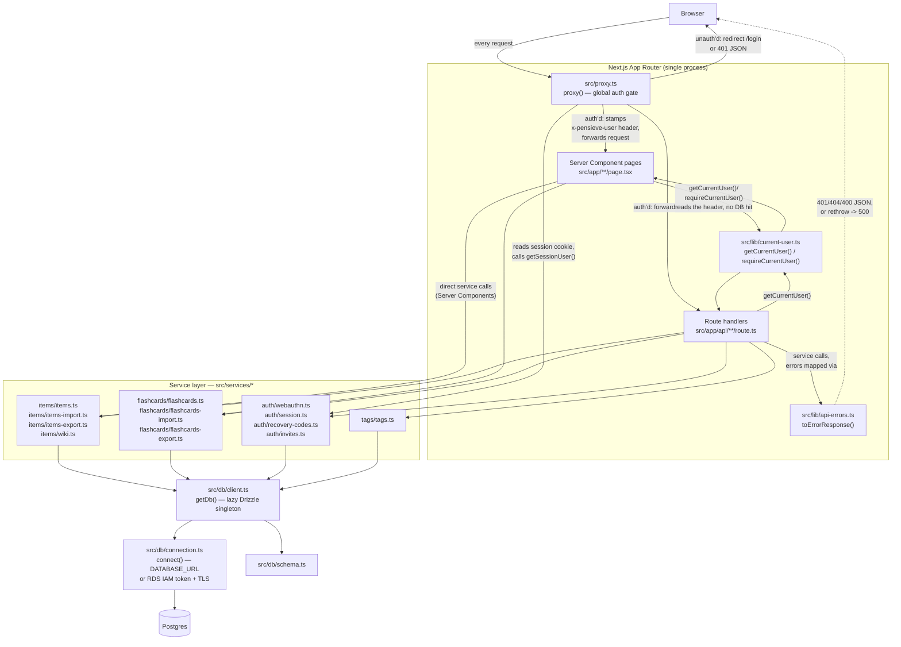

# System overview

Pensieve is a single Next.js 16 App Router application — there is no separate backend service. "The API" is a set of `route.ts` files living inside `src/app/`, colocated with the pages that call them. Everything downstream of a route handler funnels through a thin **service layer** (`src/services/*`), which is the only code allowed to touch Drizzle. Drizzle talks to Postgres over `postgres.js`.

The one piece of infrastructure worth understanding before anything else is that **every request — page or API — is authenticated the same way, in one place**: `src/proxy.ts`. Next 16 replaced the old `middleware.ts` convention with a `proxy.ts` file exporting a `proxy()` function (confirmed by reading the file directly — see the note at the end of this page on why that needed a raw read rather than a graphify query).

## Request lifecycle

Reading this left to right: **`proxy()` is the only place a session token is ever validated against the database.** Everything after it — pages and API routes alike — trusts a request header instead of re-querying. That's a deliberate tradeoff documented directly in the source (`src/proxy.ts:35-48`): a real DB-backed session lookup on every request (rather than an optimistic, cookie-only check) is what makes server-side session revocation possible, and the comment explicitly says this is fine "for a handful of trusted users on a sub-€10/month budget" — revisit if traffic ever grows.

## The auth gate, in detail

`proxy()` (`src/proxy.ts:61-87`) runs on every request matching its `config.matcher` (everything except `_next/static`, `_next/image`, `favicon.ico`, and the app icon route). It does three things:

1. **Allow-list check.** A small `PUBLIC_PATHS` set (login page, the six `register`/`login`/`recover`/`invite` options/verify API routes) plus any `/invite/<token>` path skip auth entirely — these are exactly the endpoints needed to *establish* a session in the first place (`src/proxy.ts:22-45`). The one exception that isn't about establishing a session is the exact path `/api/health`, the readiness probe, which reveals only up/down (see [Health check](/flows/health-check)).
2. **Session lookup.** For everything else, it reads the `session` cookie and calls `getSessionUser(getDb(), token)` (`src/services/auth/session.ts:39-63`), which hashes the token, joins `sessions` to `users`, and throws `UnauthorizedError` if the row is missing or expired.
3. **Header stamping.** On success, it strips any client-supplied `x-pensieve-user` header (so a client can't spoof it) and sets its own, base64-encoding the resolved `{id, displayName, role}` (`src/lib/auth-cookies.ts:29-31`). On failure, API paths get a `401` JSON body; page paths get redirected to `/login`.

Downstream code never re-touches the database for "who is this." `src/lib/current-user.ts` just reads and decodes that header:

- `getCurrentUser()` throws `UnauthorizedError` if the header is missing (shouldn't happen post-proxy, but routes handle it via `toErrorResponse`).
- `requireCurrentUser()` — used by Server Component pages — catches that and calls Next's `redirect("/login")` instead, so a page never has to duplicate the "no session, bounce to login" pattern.

## Routes → services → Drizzle → Postgres

Route handlers (`src/app/api/**/route.ts`) are intentionally thin. A typical route (e.g. `src/app/api/items/import/route.ts`) does: parse the JSON body, validate its shape with a helper from `src/lib/request-fields.ts`, call `getCurrentUser()`, call exactly one service function, and either return `NextResponse.json(result)` or catch the error and hand it to `toErrorResponse()` (`src/lib/api-errors.ts:9-20`). That function maps the three service-layer error classes (`src/services/errors.ts`) to HTTP status:

| Thrown | Status |
|---|---|
| `UnauthorizedError` | 401 |
| `NotFoundError` | 404 |
| `ValidationError` | 400 |
| anything else | rethrown → framework 500 |

Services (`src/services/items/items.ts`, `src/services/flashcards/flashcards.ts`, `src/services/auth/webauthn.ts`, etc.) are where all business logic and every Drizzle query lives — nothing outside `src/services/*` and `src/db/*` imports `drizzle-orm` directly (confirmed via `graphify explain "drizzle-orm"`, whose only importers are `src/db/schema.ts`, `src/db/client.ts`, and files under `src/services/`). Every service function takes a `Database` (the Drizzle handle type from `src/db/client.ts:6`) as its first argument rather than importing a singleton — this is what makes services testable against a real disposable per-test-run Postgres schema without touching the module-level `getDb()` cache.

`getDb()` itself (`src/db/client.ts:13-19`) is a lazy singleton: the `postgres.js` connection and the Drizzle wrapper are only constructed on first call, so importing a service module (e.g. under Vitest) never opens a DB connection until something actually calls a DB-touching function. It gets its `postgres.js` client from `connect()` in `src/db/connection.ts`, the one module that decides how to reach Postgres (the DB image's `migrate.cjs` uses it too). With `DATABASE_URL` set, as in local development, CI and tests, that URL is used unchanged. Without it, the connection comes from `PGHOST`/`PGPORT`/`PGDATABASE`/`PGUSER` and authenticates with RDS IAM: postgres.js calls the password function for every new connection, which signs a fresh 15-minute token with the task role's credentials, and TLS is verified against the RDS CA bundle shipped in the image (`certs/rds-global-bundle.pem`). `getDb()` is graphify's single highest-degree node in the whole graph — 71 edges — because essentially every route and every service imports it directly (see [module structure](/architecture/module-structure)).

## WebAuthn passkey auth and session cookies

Passkey registration/login itself is a separate flow from the per-request auth gate above — it's how a session cookie gets created in the first place. See **[Login with a passkey](/flows/login-with-passkey)** for the full sequence diagram (happy path plus failure branches). In short:

- `src/services/auth/webauthn.ts` wraps `@simplewebauthn/server` to generate and verify registration/authentication ceremonies, and is the only place a `webauthn_credentials` row is read or written.
- `src/services/auth/session.ts` owns the `sessions` table: `createSession()` mints a random 32-byte token, stores only its SHA-256 hash (`src/services/auth/session.ts:25-28`), and returns the raw token to the caller — the DB never holds a replayable session secret.
- `src/lib/auth-cookies.ts` is the single place every httpOnly cookie this app sets — session, WebAuthn challenge, recovery code, invite token — gets its name, `maxAge`, and `secure`/`sameSite` flags (`src/lib/auth-cookies.ts:45-58`), so those don't drift between the four call sites.

## Theme preference (light/dark)

One non-auth cookie sits outside `auth-cookies.ts` on purpose: `theme` (`"dark"` or `"light"`). `RootLayout` (`src/app/layout.tsx`) reads it via `cookies()` on every request and renders `<html data-theme={theme}>` — a Server Component read, not client-side detection, so the correct theme is present on the very first rendered byte with no flash of the wrong theme. `ThemeToggle.tsx` (rendered inside `AccountMenu.tsx`) writes the cookie directly from the client (`document.cookie`, non-`httpOnly`) rather than through a route handler: unlike the session/WebAuthn/recovery/invite cookies above, this one holds no secret and gates no authorization decision, so the extra indirection of a dedicated API route isn't worth it. After writing the cookie, the toggle calls `router.refresh()` to re-render the server tree (including `RootLayout`) with the new value. All theme-dependent CSS custom properties (`--color-*`) live under `[data-theme="dark"]`/`[data-theme="light"]` selectors in `src/app/globals.css`, so this one attribute drives every themed color in the app.
