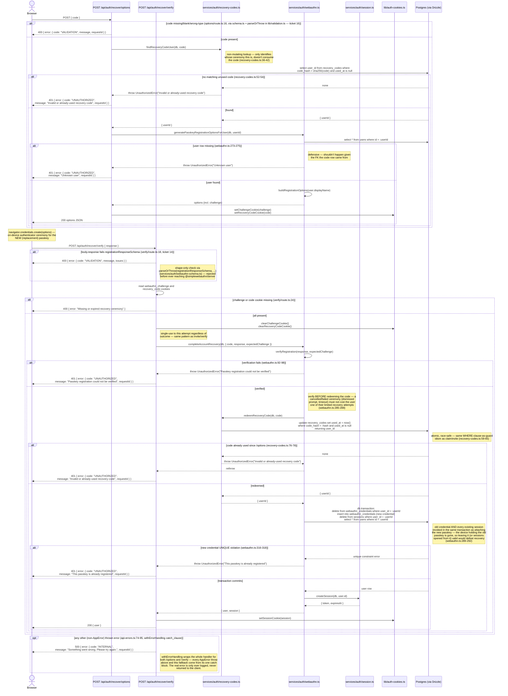

# Account Recovery

Covers how a user regains access after losing their passkey device, using
one of the one-time recovery codes issued at registration. Routes:
`src/app/api/auth/recover/options/route.ts`,
`src/app/api/auth/recover/verify/route.ts`, backed by
`src/services/auth/recovery-codes.ts` and `completeAccountRecovery` in
`src/services/auth/webauthn.ts`.

## Where recovery codes come from

Ten recovery codes are generated once — and only once — per account:
`generateRecoveryCodes` (`src/services/auth/recovery-codes.ts:17-34`) is
called at the moment an account is created, both for the bootstrap admin
(`registerPasskey`, `webauthn.ts:181-184`) and for an invited member
(`redeemInvite`, `webauthn.ts:250-253`) — see
[Register with invite](/flows/register-with-invite). Each code is shown to
the caller exactly once, in the registration response; only its SHA-256
hash (`recoveryCodes.codeHash`) is ever persisted, so a stolen DB dump
can't be replayed as a usable code — the same pattern session tokens and
invite tokens use (see [Database schema](/architecture/database-schema)).

**There is no code that calls `generateRecoveryCodes` anywhere else in the
codebase** — recovery itself does not reissue a fresh batch. A user's ten
codes are a fixed, non-renewing pool for the lifetime of the account; each
one is single-use (`redeemRecoveryCode`'s `usedAt IS NULL` guard,
`recovery-codes.ts:66-81`), and there's no admin or self-service action
that tops the pool back up. Worth surfacing this to users explicitly if
Pensieve is ever deployed for real: running out of unused codes with no
working passkey is a genuine account-lockout risk this design accepts.

## Recovery ceremony

Recovering swaps in a *replacement* passkey — it isn't just "log back in,"
it's "prove you hold a valid recovery code, then register a brand-new
credential that becomes the account's only one."

## Notable details

- **This is a one-passkey-at-a-time model.** Recovery deletes *every*
  existing `webauthn_credentials` row for the user before inserting the
  replacement (`webauthn.ts:308-309`) — there's no concept of multiple
  registered devices to choose among; recovering with one code replaces
  whatever passkey(s) existed with exactly one new one.
- **Recovery force-logs-out every session**, not just the one making the
  recovery request (`delete from sessions where user_id = :userId`,
  `webauthn.ts:310`) — if the account was logged in on another device or
  browser, that session is invalidated too. This is treated as correct
  behavior, not a side effect to work around: the doc comment frames it as
  the whole point (the old device is presumed compromised or gone).
- **The response never includes new recovery codes.** `POST
  /api/auth/recover/verify` returns only `{ user }`
  (`recover/verify/route.ts:43`), unlike registration's `{ user,
  recoveryCodes }`. Combined with the "no regeneration" fact above, a user
  who recovers their account is left with one fewer usable code than before
  (the one they just spent), permanently.
- **`findRecoveryCodeUser`'s non-mutating lookup exists for exactly one
  reason**: `/options` needs to know *whose* replacement-passkey ceremony
  to build (`generatePasskeyRegistrationOptionsForUser` needs a `userId`)
  before that ceremony has succeeded — so the code can't be marked used
  yet. Actual redemption is deferred to `/verify`, mirroring
  [Register with invite](/flows/register-with-invite)'s
  check-then-claim split for the same reason.
