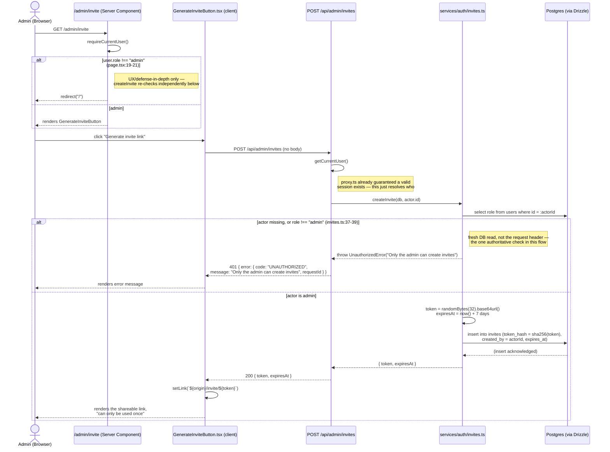

# Admin: Manage Invites

Covers the one admin-only action in this app: generating a single-use
invite link. Route: `src/app/api/admin/invites/route.ts` (`POST`); page:
`src/app/admin/invite/page.tsx`, with the client trigger in
`src/app/GenerateInviteButton.tsx`. Backed by `createInvite` in
`src/services/auth/invites.ts`.

There is currently **no list or revoke endpoint** for invites — `POST
/api/admin/invites` is the entire surface. An admin generates a link,
copies it, and shares it out of band (the UI comment at
`GenerateInviteButton.tsx:7-10` is explicit: "there's no email-sending
capability here or anywhere else in the app"). An unwanted invite can only
become unusable by expiring on its own 7-day TTL
(`INVITE_TTL_MS`, `src/services/auth/invites.ts:8`) — there's no admin
action to invalidate one early.

## Where the "admin-only" check actually lives

This is the flow the task brief specifically flagged as worth checking
against `src/proxy.ts` (Next 16's renamed `middleware.ts`) — and the
answer is that **`proxy.ts` has no role awareness at all.** Reading it
directly (`src/proxy.ts:1-76`): its only job is validating that a session
cookie resolves to a real, unexpired session row (`getSessionUser`) and
stamping the resolved user (id/displayName/**role**) onto a trusted request
header for downstream code to read. It never inspects that role itself to
allow or deny a request — `/api/admin/invites` isn't in `proxy.ts`'s
`PUBLIC_PATHS` allowlist (`proxy.ts:14-24`), so an unauthenticated caller
is rejected there, but *any* authenticated session — member or admin —
passes `proxy.ts` equally.

The actual admin-only enforcement is layered in two other places instead:

1. **The page** (`src/app/admin/invite/page.tsx:17-21`) redirects a
   non-admin to `/` before rendering the "Generate invite link" button —
   but this is explicitly documented as "UX/defense-in-depth only," the
   same pattern `requireCurrentUser` uses to bounce an unauthenticated
   visitor to `/login`.
2. **The service layer** (`createInvite`,
   `src/services/auth/invites.ts:33-52`) independently re-checks the
   caller's role **against the database**, not against the client-supplied
   session/header — `actor.role !== "admin"` throws
   `UnauthorizedError("Only the admin can create invites")` before an
   invite row is ever written. This is the one enforcement point that
   actually matters for security; the route and page checks above are
   there to fail fast and give better UX, not to be the authoritative
   guard.

The route handler itself (`src/app/api/admin/invites/route.ts:7-10`) has a
comment saying exactly this: "Not in `src/proxy.ts`'s public-path
allowlist, so this route is only reachable with a valid session already;
`createInvite` additionally verifies that session's user is the admin,
since the service layer (not this route) owns permission checks." This
matches the pattern used throughout the app (see
[System overview](/architecture/system-overview)): `proxy.ts` establishes
*who you are*, and every finer-grained permission decision (creator-or-admin
on an item, admin-only on an invite, open-edit on a flashcard) is the
service layer's job, checked fresh per call rather than cached anywhere.

## Generate an invite

Only the token's hash is persisted (`sha256Hex(token)`, `invites.ts:46`) —
the same pattern session tokens and recovery codes use (see
[Database schema](/architecture/database-schema)) — so a database dump
alone can't be turned into a usable invite link. See
[Register with invite](/flows/register-with-invite) for what happens once
the generated link is opened and redeemed.
