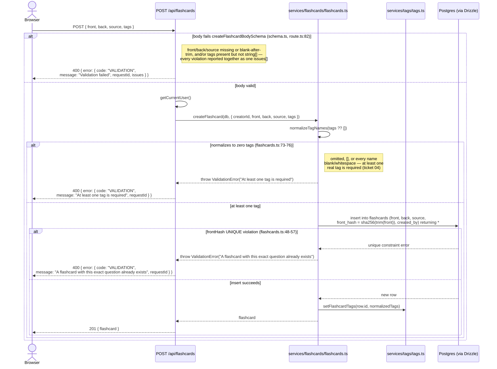
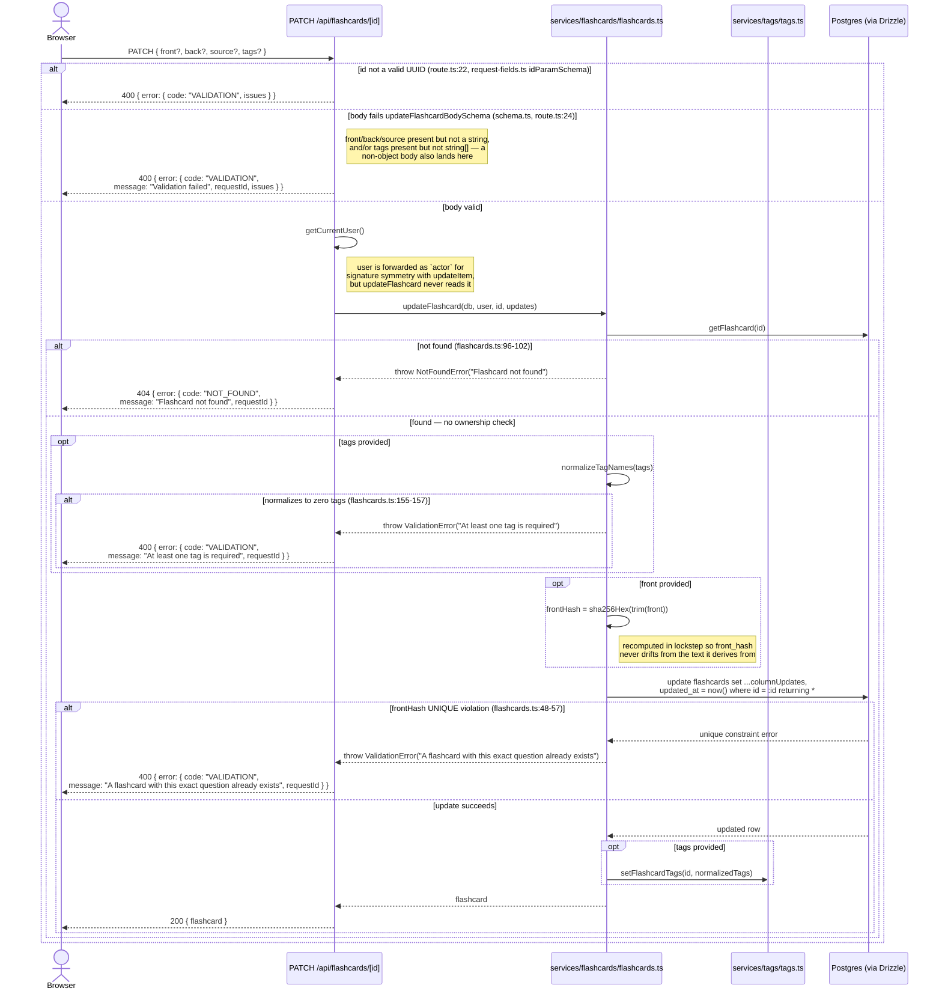
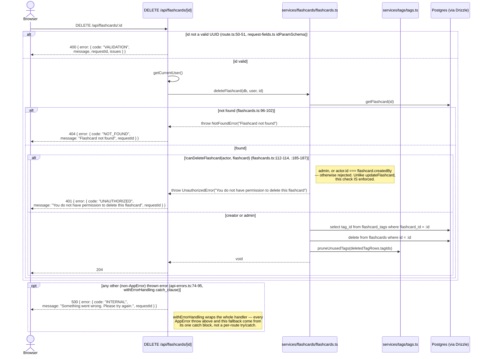

# Flashcard Lifecycle

Covers create, edit, and delete for a flashcard. Routes:
`src/app/api/flashcards/route.ts` (GET list / POST create) and
`src/app/api/flashcards/[id]/route.ts` (PATCH / DELETE), backed by
`src/services/flashcards/flashcards.ts`. See
[Flashcards import/export](/flows/flashcards-import-export) for the bulk
frontmatter-file path, and [Flashcard study session](/flows/flashcard-study-session)
for how cards are consumed after creation.

## List: `?limit=`/`?tags=` validation

`GET /api/flashcards` (`src/app/api/flashcards/route.ts:58-72`) always pages
(keyset, ticket 04) — `?limit=` defaults to `FLASHCARDS_PAGE_SIZE` when
absent, but ticket 19 replaced the removed `parseLimitParam`'s silent
clamp-to-default with strict rejection: `limitQuerySchema`
(`src/lib/query-schemas.ts`, shared with `GET /api/items`), run through
`parseOrThrow`, now returns `400 { error: { code: "VALIDATION", issues:
[{ field: "", message }] } }` for a non-integer or out-of-range `?limit=`
instead of silently substituting the default. `?tags=`/`?cursor=` are
validated too (`tagsQuerySchema`/`cursorParamSchema`, same shared module),
though neither can actually reject anything — any string, or absence, is
valid input to each, and a malformed `?cursor=` is still only ever caught
downstream, at `listFlashcards`'s decode step.

## The permission asymmetry, up front

Unlike items, **update and delete are not governed by the same rule.**
`updateFlashcard` (`src/services/flashcards/flashcards.ts:129-140`) is
documented as deliberately open-edit: "any authenticated actor may update
any flashcard, with no ownership/role check at all." `deleteFlashcard`
(`flashcards.ts:176-198`), by contrast, gates on `canDeleteFlashcard`
(`flashcards.ts:104-114`) — admin, or the flashcard's own creator — the
same creator-or-admin rule `items.ts`'s `canModifyItem` uses. A comment on
`canDeleteFlashcard` even notes this was **originally creator-only with no
admin case**, and was widened to admin-or-creator later because the
creator-only version "had no recorded rationale." Any signed-in member can
therefore edit a card's front/back/source/tags freely, but can only delete
a card they created (or if they're an admin) — worth knowing before
assuming the two operations share one guard.

## Create

`front_hash` (`flashcards.ts:85`, a `sha256Hex` of the *trimmed* `front`
text) is never accepted as caller input — it's derived server-side, so
there's nothing for a client to spoof or drift out of sync. The
`flashcards.front_hash` column carries a `UNIQUE` constraint (see
[Database schema](/architecture/database-schema)), which is what makes the
duplicate-question rejection above a real database-level guarantee rather
than an application-level race.

## Edit

Note that an explicit `tags: []` (or an array that normalizes to nothing
once blanks are filtered) is rejected the same way at both create and
update — a flashcard's last tag can't be stripped this way. Omitting
`tags` from the PATCH body entirely, by contrast, always leaves the
current tags untouched (same convention as `items.ts`).

## Delete

Ticket 19 added `?cascade=` validation (`cascadeQuerySchema`,
`src/lib/query-schemas.ts`) to `DELETE /api/items/[id]`'s equivalent
diagram, where it gates whether deleting a wiki article also deletes its
children. It's deliberately absent here: `deleteFlashcard` takes no
`cascade`/options argument at all — flashcards have no parent/child
relationship to cascade through — and this handler has never read
`searchParams`, so there's nothing for this ticket to validate.
