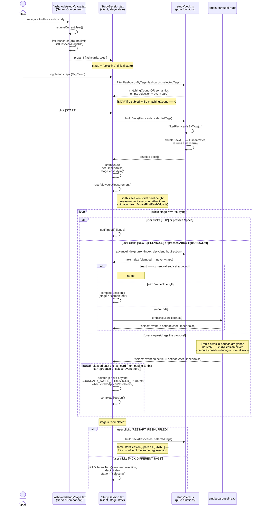

# Flashcard Study Session

Unlike every other flow in these docs, a study session is almost entirely
**client-side** — there is no `/api/flashcards/study` route, and no further
network round trip happens once the page loads. `src/app/flashcards/study/page.tsx`
is a Server Component that fetches the *entire* flashcard pool and tag list
once (`listFlashcards(db)` with no `limit`, and `listFlashcardTags(db)`,
`page.tsx:26`) and hands both down as props to `StudySession.tsx` (a
`"use client"` component, `src/app/flashcards/study/StudySession.tsx`),
which owns every bit of session state itself: tag selection, the shuffled
deck, the current card index, and flip state. Starting, restarting, or
going back to tag selection never re-fetches anything — it's all recompute
over the props the page already has.

## Why the whole pool, unpaginated

`page.tsx:22-24` notes explicitly: "the study deck needs the entire pool up
front to shuffle from, unlike the paginated `/flashcards` management list."
`listFlashcardTags` (`page.tsx:26`) additionally scopes the tag-selection
cloud to tags actually attached to at least one flashcard, so an item-only
tag never shows up as a distractor option that would silently produce an
empty deck.

## Stage machine

## Notable design choices

- **`advanceIndex` (`deck.ts:44-47`) is the single index-advance function
  every input method shares** — the `[PREVIOUS]`/`[NEXT]` buttons, arrow
  keys, and the boundary-swipe check all call through it rather than each
  re-implementing the clamping/bounds logic. It never wraps: `prev` at the
  first card and `next` at or past the end both clamp in place, and reaching
  `deckLength` (one past the last valid index) is the defined signal to show
  the completion screen rather than an out-of-bounds error.
- **In-bounds swipe navigation bypasses `advanceIndex` entirely.** A normal
  swipe/drag is handled natively by Embla's own drag-and-snap engine; only
  the "swipe past the last card" case needs a manual check
  (`handleViewportPointerUp`, `StudySession.tsx:182-190`), because a
  non-looping Embla carousel structurally can't scroll past its last slide
  and so never fires the `select` event a normal navigation relies on.
  `BOUNDARY_SWIPE_THRESHOLD_PX` (80px, `StudySession.tsx:28`) exists purely
  to detect that one gesture; it never drives any visual motion of its own.
- **`goToDirection` reads Embla's own `selectedScrollSnap()`, not React's
  `index` state, as the base for the next computation**
  (`StudySession.tsx:158-168`) — so rapid repeated button presses or key
  taps each compute off the carousel's actual current position rather than
  racing a not-yet-applied `setIndex` call.
- **Only the current card and its immediate neighbors mount real
  `Flashcard` content** (`Math.abs(deckIndex - index) <= 1`,
  `StudySession.tsx:355`); farther slides stay empty placeholders so a large
  deck doesn't render every card's markdown for the life of the session.
  Only the current slide ever receives the live `flipped` value — every
  other mounted slide stays unflipped, so navigating to a neighbor never
  visibly reveals its answer early.
- **`resetViewportMeasurement()` is called explicitly on every
  `startSession()`** (`StudySession.tsx:119`, including a restart), not
  just once — because `cardHeights` persists across sessions in the same
  browser session, a restart that happens to land on a previously-seen
  (already height-cached) card would otherwise not be recognized as a fresh
  session's first measurement, and would skip the "snap instead of animate"
  treatment `isFirstViewportMeasurement`/`useFirstRealValue.ts` provides.
