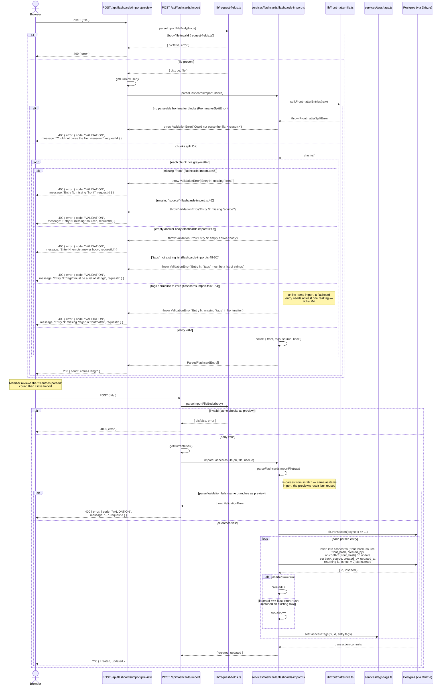

# Flashcards Import / Export

Members can batch-import flashcards from a frontmatter-delimited Markdown
file (preview, then commit) and export every flashcard back out in the same
format. Routes: `src/app/api/flashcards/import/preview/route.ts`,
`src/app/api/flashcards/import/route.ts`, and
`src/app/api/flashcards/export/route.ts`, backed by
`src/services/flashcards/flashcards-import.ts` and
`src/services/flashcards/flashcards-export.ts`.

This is the flashcards counterpart to
[Items import/export](/flows/items-import-export) and shares the same
preview-then-commit shape, but **it behaves differently in one important
way: it dedupes.**

## The headline difference: hash-based upsert, not append-only

Items import never matches an existing row — every entry always creates a
new item, by explicit design (see
[Items import/export](/flows/items-import-export)). Flashcards import does
the opposite: `importFlashcardsFile`
(`src/services/flashcards/flashcards-import.ts:85-140`) **upserts on
`frontHash`** — a `SHA-256` of the entry's trimmed `front` text, backed by
the `flashcards.front_hash` `UNIQUE` constraint (see
[Database schema](/architecture/database-schema)). An entry whose front
text matches an existing card's `front_hash` updates that card's
`back`/`source`/tags in place; every other entry creates a new card. Both
created and updated cards are attributed to the importing member
(`creatorId`), never to any authorship implied by the file itself.

The upsert is a single Drizzle `.onConflictDoUpdate({ target:
flashcards.frontHash, ... })` call per entry
(`flashcards-import.ts:111-127`), and whether that particular call inserted
or updated is read off the classic Postgres idiom for exactly this
question: a fresh insert's `xmax` system column is `0`; an updated row's
`xmax` is the transaction ID that just wrote it. The
`` `.returning({ ..., inserted: sql`(xmax = 0)` })` `` clause turns that
into a plain boolean the code branches on (`flashcards-import.ts:127-133`) to build the `{ created,
updated }` counts returned to the caller — no separate `SELECT` needed to
find out which happened.

## Import: preview, then commit



Like items import, this is **all-or-nothing at two levels**: parsing
(`parseFlashcardsImportFile` validates every entry before any write
happens) and writing (the whole loop runs inside one `db.transaction`, so a
failure partway through can't leave a partial batch committed). The
difference is purely in what a "successful" write does per entry — create
vs. upsert — not in the atomicity guarantee around it.

## Export

```mermaid
sequenceDiagram
    actor Browser
    participant ExportRoute as GET /api/flashcards/export
    participant ExportSvc as services/flashcards/flashcards-export.ts
    participant FlashcardsSvc as services/flashcards/flashcards.ts
    participant DB as Postgres (via Drizzle)

    Browser->>ExportRoute: GET /api/flashcards/export
    ExportRoute->>ExportRoute: getCurrentUser()
    Note right of ExportRoute: any authenticated member can export —<br/>no admin-only gating, same rule as<br/>items export
    ExportRoute->>ExportSvc: exportFlashcardsFile(db)
    ExportSvc->>FlashcardsSvc: listFlashcards(db) — no limit
    Note right of FlashcardsSvc: called with no `limit`, so this<br/>returns every card unpaginated<br/>regardless of workspace size
    FlashcardsSvc->>DB: select * from flashcards (+ tags)
    DB-->>FlashcardsSvc: every flashcard row
    FlashcardsSvc-->>ExportSvc: flashcards[]
    ExportSvc->>ExportSvc: matter.stringify(card.back, { front, tags, source })<br/>per card, joined into one file
    ExportSvc-->>ExportRoute: file: string
    ExportRoute-->>Browser: 200 text/markdown<br/>Content-Disposition: attachment,<br/>filename="flashcards-export.md"

    opt any other (non-AppError) thrown error (api-errors.ts:74-95, withErrorHandling catch_clause)
        ExportRoute-->>Browser: 500 { error: { code: "INTERNAL",<br/>message: "Something went wrong. Please try again.", requestId } }
        Note right of ExportRoute: withErrorHandling wraps the whole handler — an<br/>AppError throw gets its own status/code/message<br/>(as in the import diagram above); anything else<br/>falls back to this generic 500.
    end
```

`gray-matter`'s `stringify` always emits a trailing newline before the next
entry's `---`, so simply joining every entry's output with no extra
separator round-trips cleanly back through `splitFrontmatterEntries` — an
exported file re-imports as the same number of entries it was exported
with (modulo any further edits).
