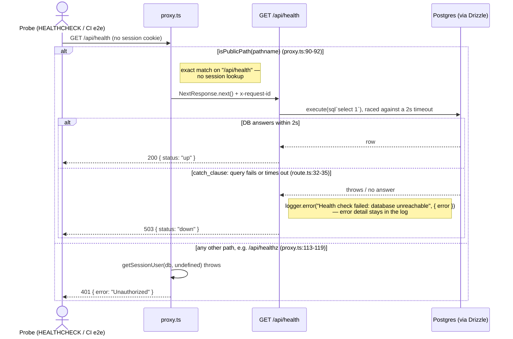

# Health Check

Covers the readiness probe the container `HEALTHCHECK` and the CI e2e job
poll to tell when the app can actually serve requests. Route:
`src/app/api/health/route.ts` (`GET`), gated by `src/proxy.ts`.

It is the **only API route reachable without a session.** `/api/health` is
an exact entry in the proxy's `PUBLIC_PATHS` set (`proxy.ts:22-36`), so
look-alike paths (`/api/health/x`, `/api/healthz`) still go through the
normal session check and get a 401. To keep that exception as small as
possible, the response says nothing beyond up or down: `{ "status": "up" }`
or `{ "status": "down" }`. When the database doesn't answer, the error goes
to the server log only. It can carry a hostname, a port or a connection
string, so it never reaches the response body.

"Up" means the database answered a trivial `SELECT 1`, not just that the
Node process is alive. A broken DB connection therefore shows as unhealthy.
The query is raced against a 2-second timeout. Without it, an unreachable
host would hold the probe for postgres.js's 30-second connect timeout, far
longer than any probe waits, so a slow database also counts as down.

The handler is deliberately **not** wrapped in `withErrorHandling`, unlike
every other route. That wrapper turns a throw into a 500 and writes an info
log line per request. A probe polled every few seconds needs a 503 on
failure and no log noise while healthy.

