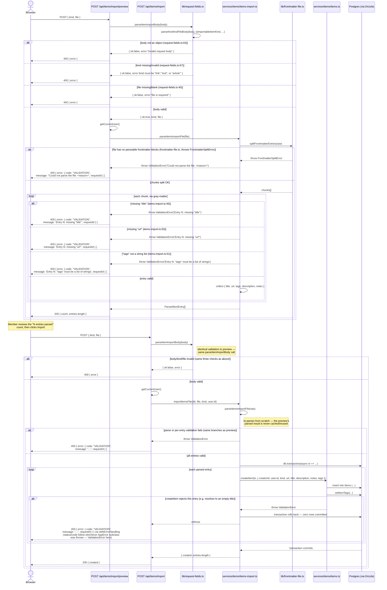

# Items Import / Export

Members can batch-import links/tools/articles from a frontmatter-delimited
Markdown file, preview a file before committing it, and export every item of
a given kind back out in the same format. Three routes are involved:
`src/app/api/items/import/preview/route.ts`,
`src/app/api/items/import/route.ts`, and
`src/app/api/items/export/route.ts`, backed by
`src/services/items/items-import.ts` and `src/services/items/items-export.ts`.

Wiki pages (`kind: "page"`) are explicitly out of scope for both — the
importable/exportable kinds are only `link`, `tool`, and `article`
(`isImportableItemKind`, `src/services/items/items.ts:29`).

## Import: preview, then commit



### On "duplicate detection"

There isn't any, for items — and that's a deliberate choice, not a gap.
`importItemsFile`'s own doc comment says so directly
(`src/services/items/items-import.ts:132-139`): *"Unlike the flashcard
importer, this never matches/updates an existing item — every entry always
creates a new row."* Re-importing the same file twice produces two full sets
of duplicate items. Contrast with the **flashcards** importer
(`src/services/flashcards/flashcards-import.ts`, out of scope for this
page), which upserts by `front_hash` — a SHA-256 of the trimmed `front`
text, with a `UNIQUE` constraint backing it
(`flashcards.front_hash`, see [Database Schema](/architecture/database-schema))
— specifically because two flashcards with an identical question are
supposed to collapse into one. Items have no equivalent natural key to
dedupe on (two links can legitimately share a title), so the importer
doesn't try.

What items *do* get instead is **all-or-nothing atomicity** at two levels:
parsing (`parseItemsImportFile` validates every entry before any write
happens — one bad entry fails the whole file, not just that row) and
writing (`importItemsFile` wraps every `createItem` call in a single
`db.transaction`, so a failure partway through a large import can't leave a
partial batch committed).

## Export

```mermaid
sequenceDiagram
    actor Browser
    participant ExportRoute as GET /api/items/export
    participant ExportSvc as services/items/items-export.ts
    participant ItemsSvc as services/items/items.ts
    participant DB as Postgres (via Drizzle)

    Browser->>ExportRoute: GET /api/items/export?kind=link
    ExportRoute->>ExportRoute: kind = parseOrThrow(exportKindParamSchema, searchParams.get("kind"))

    alt kind missing or not link/tool/article (export/route.ts:20, via query-schemas.ts + parseOrThrow in lib/validation.ts — ticket 19)
        ExportRoute-->>Browser: 400 { error: { code: "VALIDATION",<br/>message: 'kind must be "link", "tool", or "article"', requestId, issues } }
    else kind valid
        ExportRoute->>ExportRoute: getCurrentUser()
        Note right of ExportRoute: any authenticated member can export —<br/>no admin-only gating, same rule as<br/>the flashcards export
        ExportRoute->>ExportSvc: exportItemsFile(db, kind)
        ExportSvc->>ItemsSvc: listItems(db, { kinds: [kind] })
        ItemsSvc->>DB: select * from items where kind = :kind (+ filters)
        DB-->>ItemsSvc: item rows
        ItemsSvc-->>ExportSvc: items[]
        ExportSvc->>ExportSvc: matter.stringify(notes, { title, url, tags, description? })<br/>per item, joined into one file
        ExportSvc-->>ExportRoute: file: string
        ExportRoute-->>Browser: 200 text/markdown<br/>Content-Disposition: attachment,<br/>filename="{kind}s-export.md"
    end

    opt any other (non-AppError) thrown error (api-errors.ts:74-95, withErrorHandling catch_clause)
        ExportRoute-->>Browser: 500 { error: { code: "INTERNAL",<br/>message: "Something went wrong. Please try again.", requestId } }
        Note right of ExportRoute: withErrorHandling wraps the whole handler — an<br/>AppError throw gets its own status/code/message<br/>(as in the import diagrams above); anything else<br/>falls back to this generic 500.
    end
```

`description` is only written into the frontmatter block when the item has
one — a `null` description is omitted entirely rather than round-tripped as
a literal YAML `null` (`items-export.ts:26-28`), so a re-imported export
file parses identically to a hand-authored one.
