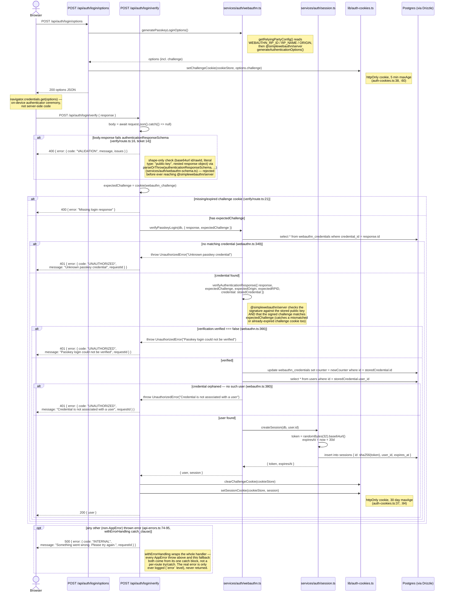

# Login with Passkey

WebAuthn login is a two-request ceremony: an **options** call that hands the
browser a challenge, a client-side interaction with the user's authenticator
(Face ID, a security key, a platform passkey — outside this app's source
entirely), and a **verify** call that checks the signed response and starts
a session. The two routes are `src/app/api/auth/login/options/route.ts` and
`src/app/api/auth/login/verify/route.ts`; the actual WebAuthn logic lives in
`src/services/auth/webauthn.ts`.

## Notes on the error branches

All three `UnauthorizedError` throws inside `verifyPasskeyLogin`
(`src/services/auth/webauthn.ts:338-389`) are deliberately generic-sounding
at the HTTP boundary but distinct in the source, each guarding a different
failure mode:

1. **Unknown credential** (`webauthn.ts:349`) — the `credentialId` the
   browser presented doesn't exist in `webauthn_credentials` at all. Can't
   happen from a normal login attempt with a real registered passkey;
   indicates either a stale/deleted credential or a forged request.
2. **Verification failed** (`webauthn.ts:366`) — the credential exists, but
   `verifyAuthenticationResponse()` rejected the signed assertion. This is
   the branch that actually covers both a **cryptographic signature
   mismatch** and a **challenge mismatch**: SimpleWebAuthn's verification
   checks the returned `clientDataJSON.challenge` against
   `expectedChallenge` as part of the same call, so a replayed or
   tampered-with response fails here, not as a separate case.
3. **Orphaned credential** (`webauthn.ts:380`) — the credential's `user_id`
   no longer resolves to a `users` row. Shouldn't happen given the FK
   (`webauthn_credentials.user_id -> users.id ON DELETE CASCADE` —
   see [Database Schema](/architecture/database-schema)) guarantees the
   credential is deleted alongside its user; this branch is defensive.

A **truly expired challenge** is caught earlier and separately: the
challenge cookie itself has a 5-minute `maxAge`
(`CHALLENGE_COOKIE_MAX_AGE_SECONDS`, `src/lib/auth-cookies.ts:38`). Once it
expires, the browser simply stops sending it, so `cookieStore.get(...)`
returns `undefined` and the request never reaches `verifyPasskeyLogin` at
all — it's rejected by the `verify/route.ts:18` guard with a `400`, not a
`401` from the service layer.
