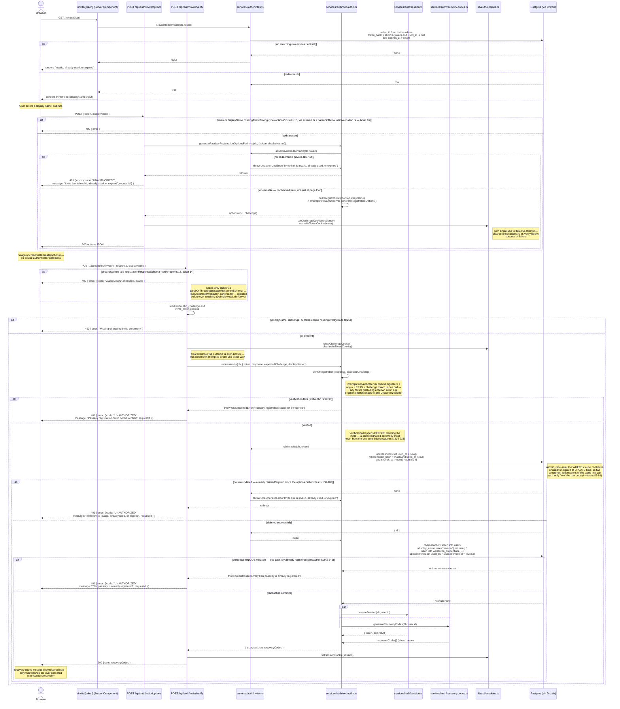

# Register with Invite

Covers how a second (and every subsequent) user joins the workspace: opening
an `/invite/<token>` link and completing passkey registration. Routes:
`src/app/invite/[token]/page.tsx`, `src/app/api/auth/invite/options/route.ts`,
`src/app/api/auth/invite/verify/route.ts`, backed by
`src/services/auth/invites.ts` and `src/services/auth/webauthn.ts`.

## Registration has exactly two paths, and this is only one of them

It's worth being explicit up front, because the routes' names are easy to
conflate: `src/app/api/auth/register/*` (`options`/`verify`) is a
**separate, bootstrap-only** path — it creates the sole `admin` account
the very first time the app is used, and is permanently closed off once any
user exists (`assertBootstrapEligible`, `src/services/auth/webauthn.ts:44-50`,
called from both `generatePasskeyRegistrationOptions` and `registerPasskey`).
`src/services/auth/webauthn.ts:135-139`'s own doc comment says it plainly:
"Bootstraps the sole admin account when `users` is empty; otherwise no open
registration path exists — member registration is driven only by an invite
token." This page covers that second, ongoing path: `/api/auth/invite/*`,
which creates a `member` account and is the only way a workspace grows past
its first user.

## Opening the link

`/invite/[token]` (`src/app/invite/[token]/page.tsx`) is a Server Component
that calls `isInviteRedeemable(db, token)`
(`src/services/auth/invites.ts:76-83`) before rendering anything — a
non-throwing wrapper around `assertInviteRedeemable`
(`invites.ts:61-70`), which checks the invite row exists, is unused
(`usedAt IS NULL`), and hasn't expired (`expiresAt > now()`), matched by the
**hash** of the token (`unredeemedInviteFilter`, `invites.ts:14-20`) —
the raw token is never stored. A dead link (already used, expired, or
simply invalid) renders a plain error message instead of the registration
form; nothing about that check is DB-mutating, so refreshing the page or
opening the same link in two tabs is safe.

## Registration ceremony

## Notable details

- **The invite is re-checked twice, independently, and claimed exactly
  once.** The page-load check (`isInviteRedeemable`) and the `/options`
  check (`assertInviteRedeemable`, called fresh inside
  `generatePasskeyRegistrationOptionsForInvite`) are both read-only and
  don't reserve anything — a link could still be redeemed by someone else
  between either of those checks and the final claim. `claimInvite`'s
  atomic `UPDATE ... WHERE used_at IS NULL AND expires_at > now() ...
  RETURNING id` (`invites.ts:93-105`) is the only step that actually
  consumes the token, and it's race-safe by construction: the same WHERE
  clause is re-evaluated at UPDATE time, so a second concurrent attempt
  simply updates zero rows rather than double-claiming.
- **Verify-then-claim ordering is deliberate**, not incidental:
  `redeemInvite` runs `verifyRegistration` before `claimInvite`
  (`webauthn.ts:227-228`) specifically so a browser-dismissed or timed-out
  WebAuthn prompt never burns the one-time link — the same ordering
  principle used in [Account recovery](/flows/account-recovery).
- **Both the challenge and invite-token cookies are cleared unconditionally**
  at the top of the `/verify` handler (`verify/route.ts:33-34`), before the
  ceremony's outcome is known — a failed attempt can't be retried with the
  same challenge/token pair, forcing a fresh `/options` call (and a fresh
  redeemability check) for another try.
- **A brand-new invited member gets recovery codes at registration time**,
  exactly like the bootstrap admin — `generateRecoveryCodes` runs in
  parallel with `createSession` (`webauthn.ts:250-253`). See
  [Account recovery](/flows/account-recovery) for how those get used later.
