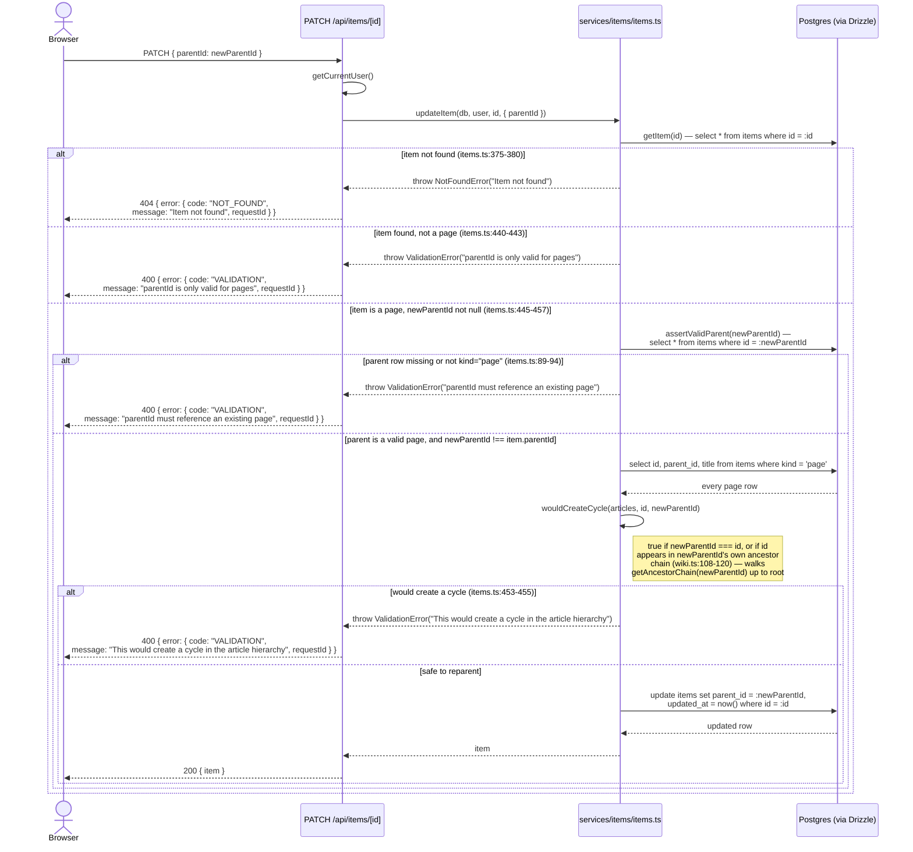
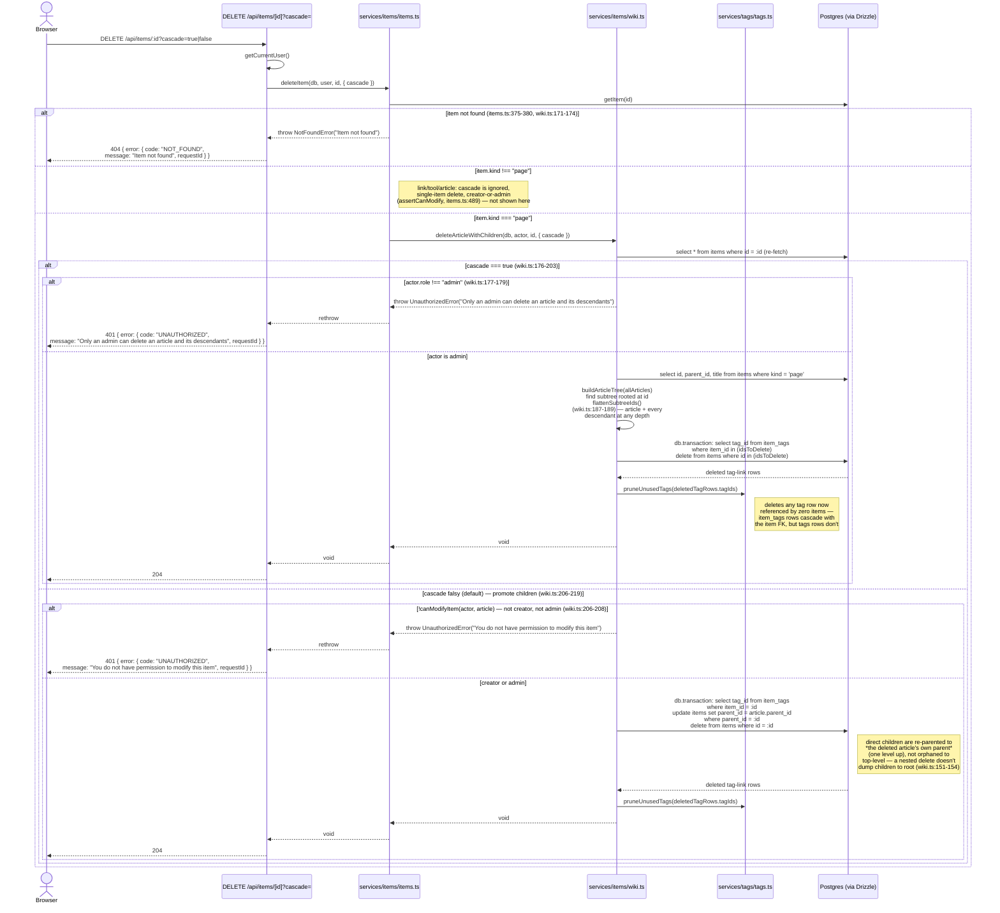

# Wiki Article Management

A wiki article is not a separate resource — it's a row in `items` with
`kind: "page"` (see [Database schema](/architecture/database-schema)). There
is no `/api/wiki/*` route; create/edit/reparent/delete all go through the
same generic items endpoints as links/tools/articles
(`src/app/api/items/route.ts` POST, `src/app/api/items/[id]/route.ts`
PATCH/DELETE), with `kind: "page"`-specific behavior branching inside
`src/services/items/items.ts` and `src/services/items/wiki.ts`.

`src/services/items/wiki.ts:1-17` documents the module's own shape: it's
mostly pure, DB-free tree helpers (`buildArticleTree`, `getAncestorChain`,
`wouldCreateCycle`) that `items.ts` composes with real queries, plus one
exception — `deleteArticleWithChildren`, the single DB-touching export,
kept here because it's the one place that composes `buildArticleTree` with
an actual delete.

## Create and edit

Create (`POST /api/items`) and edit (`PATCH /api/items/[id]`) reuse the exact
same code paths as any other item kind — see
[Item lifecycle](/flows/item-lifecycle) for the full create/edit diagram.
Two `kind: "page"`-specific rules apply inside `createItem`
(`src/services/items/items.ts:113-168`) and `updateItem`
(`items.ts:418-471`):

- A wiki page never triggers the metadata-fetch prefill that link/tool/
  article items get — `createItem`'s metadata branch is explicitly gated on
  `input.kind !== "page"` (`items.ts:126`), since a page has no URL to fetch
  from. Its `title`/`content` are always taken as given.
- `parentId` is rejected outright for any kind other than `"page"` —
  `createItem` throws `ValidationError("parentId is only valid for pages")`
  (`items.ts:133-135`) and `updateItem` throws the same
  (`items.ts:441-443`) — so a link/tool/article can never be slotted into
  the wiki tree.
- Editing a page's fields (title, content, tags, etc. — not `parentId`) skips
  the usual creator-or-admin check entirely: `updateItem` only calls
  `assertCanModify` when `item.kind !== "page"` (`items.ts:427-429`). Any
  authenticated member can edit any page's content. This is a deliberate
  asymmetry from link/tool/article items (which stay creator-or-admin) and
  from deleting a page (which is still permission-gated — see below):
  wiki pages are treated as shared, collaboratively-editable documents.

## Reparent, with cycle prevention

`wouldCreateCycle` (`src/services/items/wiki.ts:108-120`) is pure and
DB-free: given the flat list of every page row, it returns `true` in two
cases — the trivial one (`candidateParentId === articleId`, i.e. an article
can't be its own parent) and the transitive one, where it walks
`candidateParentId`'s ancestor chain via `getAncestorChain`
(`wiki.ts:81-99`) and checks whether `articleId` shows up anywhere in it. If
either is true, re-parenting would turn a tree into a cycle (unreachable
from the root, and `buildArticleTree` would silently orphan the whole
subtree as a phantom root — see `wiki.ts:37-44`'s own note on dangling
`parentId` references), so `updateItem` rejects the request with a `400`
before ever writing to the database. Note the query only re-fetches and
re-checks the full page set when `newParentId !== item.parentId`
(`items.ts:447`) — a PATCH that includes `parentId` but sets it to its
current value is a no-op for cycle-checking purposes and skips straight to
the update.

## Delete: promote vs. cascade

`DELETE /api/items/[id]?cascade=true` (`src/app/api/items/[id]/route.ts:41-52`)
reads the `cascade` query param and passes it straight through to
`deleteItem` (`items.ts:473-495`), which — for `kind: "page"` items only —
delegates the entire operation, **including its own permission check**, to
`deleteArticleWithChildren` (`wiki.ts:165-220`). This is the one place in
the wiki flow where the two modes have genuinely different authorization
rules, not just different SQL:

**The two modes are mutually exclusive and asymmetric in who's allowed to
use them** (`wiki.ts:147-163`'s doc comment spells this out explicitly):

| Mode | Trigger | Scope | Who |
|---|---|---|---|
| Promote (default) | `cascade` omitted/false | Article only; direct children re-parented one level up to *the article's own parent* | Creator or admin (`canModifyItem`) |
| Cascade | `cascade: true` | Article **and every descendant at any depth**, deleted together | Admin only |

Both modes run inside a single `db.transaction` (`wiki.ts:191-198` and
`:210-215`) so a delete can't leave a half-updated tree (e.g. children
re-parented but the article itself still present) if something fails
partway through. Both also call `pruneUnusedTags` afterward on whatever tag
IDs were freed up — `item_tags` join rows cascade-delete with the item via
its FK, but the `tags` row itself has no such cascade, so a tag now
referenced by zero items would otherwise leak.
